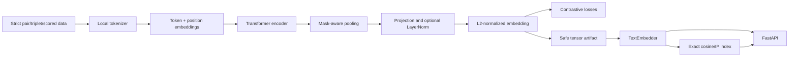

# Build Your Own Text Embedding Model

A cohesive, network-free reference system for training, evaluating, exporting, loading,
indexing, searching, and serving a small transformer text embedding model. The repository
is production-oriented engineering: versioned safe artifacts, strict schemas, bounded HTTP
requests, structured metrics, deterministic tests, containers, and CI. Its synthetic data
and tiny configuration demonstrate operability, not production semantic quality.

## Quick start

Python 3.11 or newer is required.

```bash
python3 -m venv .venv
source .venv/bin/activate
python -m pip install -e ".[dev,faiss]"

make lint
make typecheck
make test
make train-tiny
make evaluate-tiny
make build-index-tiny

embedding-project search \
  --model-path artifacts/model-tiny \
  --index-path artifacts/index-tiny \
  --query "How do I bake bread?" \
  --top-k 3
```

On Windows PowerShell, activate with `.venv\Scripts\Activate.ps1`; invoke the same
Python, pytest, Ruff, MyPy, and `embedding-project` commands directly if `make` is not
installed.

Start the API after training and indexing:

```bash
make serve
curl http://127.0.0.1:8000/health/ready
curl -X POST http://127.0.0.1:8000/v1/embeddings \
  -H 'Content-Type: application/json' \
  -d '{"texts":["first sentence","second sentence"],"normalize":true}'
```

Set `EMBEDDING_AUTH_TOKEN` to require `Authorization: Bearer …`. Terminate TLS at a
trusted ingress or service mesh; the development Uvicorn process does not provide TLS.

## Architecture



The default is masked mean pooling because every non-padding token contributes and its
behavior does not depend on a separately trained CLS objective. If \(h_i\) is token
hidden state and \(m_i\) is a binary attention mask:

```text
pooled = sum_i(h_i * m_i) / max(sum_i(m_i), 1)
```

The projected vector is L2 normalized. Therefore dot product equals cosine similarity,
which makes an inner-product index correct:

```text
q · d = cos(q, d), when ||q||₂ = ||d||₂ = 1
```

Start with the [documentation guide](docs/index.md), then follow the focused
[architecture](docs/architecture.md), [model fundamentals](docs/embedding_fundamentals.md),
[training](docs/training.md), [evaluation](docs/evaluation.md), and
[security](docs/security.md) guides.

## Public Python API

```python
from embedding_model import TextEmbedder

embedder = TextEmbedder.from_pretrained("artifacts/model-tiny")
vectors = embedder.encode(
    ["first sentence", "second sentence"],
    batch_size=32,
    normalize=True,
)
```

The output is finite `float32` with shape `(batch_size, embedding_dimension)`, preserves
input order, and has unit row norm when normalization is enabled. A string is treated as
one item. An empty iterable returns shape `(0, embedding_dimension)`. Blank individual
strings fail validation.

## CLI

Every command provides `--help` and returns non-zero on invalid input:

```text
embedding-project analyze-data
embedding-project train-tokenizer
embedding-project mine-negatives
embedding-project train
embedding-project evaluate
embedding-project export
embedding-project index
embedding-project search
embedding-project serve
embedding-project benchmark
embedding-project validate-artifacts
```

Examples:

```bash
embedding-project analyze-data --data data/sample_pairs.jsonl
embedding-project train-tokenizer \
  --data data/sample_pairs.jsonl --output-dir artifacts/tokenizer
embedding-project mine-negatives \
  --queries data/sample_queries.jsonl \
  --documents data/sample_documents.jsonl \
  --output artifacts/mined-negatives.jsonl
embedding-project validate-artifacts --model-path artifacts/model-tiny
```

## HTTP contract

- `GET /health/live`: process liveness.
- `GET /health/ready`: model readiness; returns 503 until loaded.
- `GET /version`: package version.
- `GET /v1/model`: non-sensitive model contract metadata.
- `GET /metrics`: Prometheus exposition.
- `POST /v1/embeddings`: bounded batch encoding.
- `POST /v1/similarity`: aligned pair cosine scores.
- `POST /v1/search`: index lookup.

All errors contain a stable code and request ID, not stack traces or raw input. Raw text is
not logged or used as a metric label. Request bytes, item count, text length, concurrency,
and search `top_k` are bounded by `ServingSettings`/`EMBEDDING_*`.

## Verification

```bash
pytest tests/unit/test_modeling_losses.py -q
pytest -m unit -q
pytest -m "not slow and not network and not gpu" -q
pytest -m integration -q
pytest -m end_to_end -q
ruff format --check .
ruff check .
mypy src
pytest --cov=embedding_model --cov-branch --cov-report=term-missing
python -m build
make smoke
make docker-build
```

The end-to-end test trains on CPU, checkpoints and resumes, exports and reloads,
encodes, indexes, searches, evaluates retrieval, and exercises the ASGI app. Standard
tests do not download checkpoints or use a network.

## Trust boundaries and limitations

- Exported inference weights use `safetensors`, and all artifact/index files have SHA-256
  checksums. Optimizer checkpoints use PyTorch serialization with `weights_only=True` and
  are only for trusted local training resumes.
- The exact index persists vectors as non-pickled NumPy and rebuilds FAISS `IndexFlatIP`
  when FAISS is installed. The current implementation keeps a NumPy copy to guarantee
  deterministic insertion-order tie handling; very large corpora need a sharded or
  approximate index.
- The included encoder is randomly initialized and trained only contrastively. Real
  quality normally requires a pretrained language encoder or masked-language-model
  pretraining plus representative, licensed domain data. That expensive stage is not
  implemented by the normal tiny workflow.
- The trainer is single-process. `configs/train_distributed.yaml` is a sizing example for
  the DDP boundary documented in [scaling](docs/scaling.md), not an executable DDP claim.
- The API performs synchronous model computation inside a bounded request handler.
  Multiple process workers or a dedicated dynamic batcher are required for sustained
  production concurrency.
- Exact reproducibility can still vary with hardware, drivers, PyTorch kernels, and
  parallel execution. No benchmark or model-quality claim is made from sample data.
