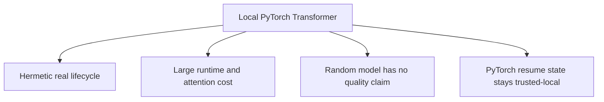

# ADR 0001: PyTorch and a local Transformer encoder

- Status: Accepted
- Decision scope: model runtime and standard test fixture

## Context

The repository must train a real encoder on ordinary CPU hardware, support optional CUDA,
remain network-free in standard CI, and expose optimizer/checkpoint primitives without hiding
model behavior behind a remote service.

## Decision drivers

| Driver | Importance |
|---|---|
| Real gradient-based training and CPU execution | Required |
| Optional CUDA, mixed precision, AdamW, and mature tensor tooling | High |
| Deterministic tiny model without downloads | Required |
| Inspectable tensor shapes and state dictionaries | High |
| Ecosystem fit with safetensors and FAISS-facing NumPy | High |

## Decision

Use PyTorch and construct the encoder locally from `nn.Embedding`,
`nn.TransformerEncoderLayer`, and `nn.TransformerEncoder`. Standard tests use small randomly
initialized weights and synthetic records.

## Alternatives considered

| Alternative | Benefit | Reason not selected |
|---|---|---|
| TensorFlow | Mature production ecosystem | Duplicates the requested PyTorch stack |
| JAX | Strong compilation/vectorization | More lifecycle work for serving/checkpoints |
| Mandatory Hugging Face checkpoint | Better initial semantics | Network/cache/license/mutability break hermetic CI |
| Remote embedding API | Minimal local model code | No local training, privacy/cost/network dependency |

## Consequences

Positive consequences are a compact inspectable encoder, real CPU/CUDA optimization, and
straightforward state testing. Costs are PyTorch runtime size, quadratic attention, and no
semantic knowledge at random initialization.

Published inference uses safetensors, not general PyTorch serialization. Adding a pretrained
adapter must preserve the public `(B, D)` finite/order/normalization contract and provide a
pinned licensed offline test fixture.

## Verification

Model/loss unit tests verify shapes, masks, hand-computed math, and finite gradients. The
end-to-end test performs actual CPU optimization, checkpoint/resume, safe export, reload, and
inference.

## Revisit when

Revisit if a different runtime has measured deployment value, or a versioned local pretrained
fixture justifies an adapter. Compare quality, portability, artifact safety, and operational
cost rather than framework preference.
