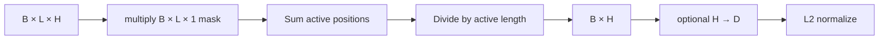
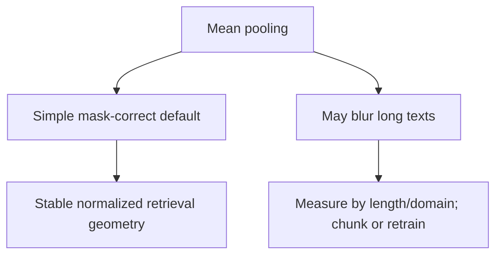

# ADR 0002: Mask-aware mean pooling by default

- Status: Accepted
- Decision scope: default token-to-text reduction

## Context

The Transformer returns `(B, L, H)` token states while retrieval needs `(B, H)`. Padding must
not affect the result, and the default must work without a special CLS pretraining objective.

## Decision drivers

| Driver | Importance |
|---|---|
| Correct attention-mask handling | Required |
| Stable gradient path from all active content tokens | High |
| No dependency on CLS-specific pretraining | High |
| Simple CPU implementation and manual testability | Medium |
| Compatibility with normalized cosine retrieval | High |

## Decision

Use attention-mask-aware arithmetic mean pooling, followed by optional projection,
LayerNorm, and default L2 normalization.

Fully padded rows fail rather than producing a plausible zero vector.

## Alternatives considered

| Strategy | Benefit | Trade-off |
|---|---|---|
| CLS | Cheap, single position | Quality depends on how CLS learned aggregation |
| Max | Preserves strong coordinate activations | Sparse gradients and outlier sensitivity |
| Mean-sqrt-length | Retains length magnitude | Normalization removes that magnitude |
| Learned attention pooling | Potentially expressive | Extra parameters/complexity and evidence needed |

## Consequences

All active positions contribute smooth gradients and padding is excluded explicitly. Long
multi-topic inputs may be over-averaged, and mean is not guaranteed to win on every domain.

Changing pooling changes learned geometry and requires retraining, re-export, held-out
evaluation, and index rebuild.

## Verification

Parametrized tests compare all four strategies against manually computed tensors whose padded
state would otherwise dominate. Failure tests reject mismatched mask shapes and fully padded
rows.

## Revisit when

Revisit when representative retrieval experiments with fixed data, seeds, confidence
intervals, latency, and collapse diagnostics show a materially better strategy.
