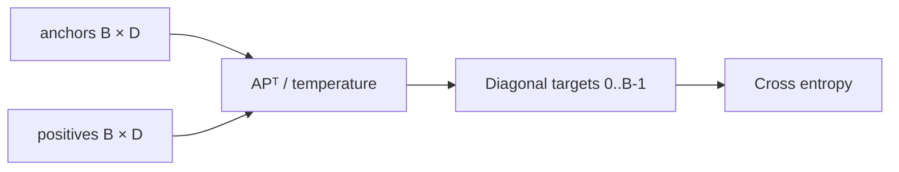
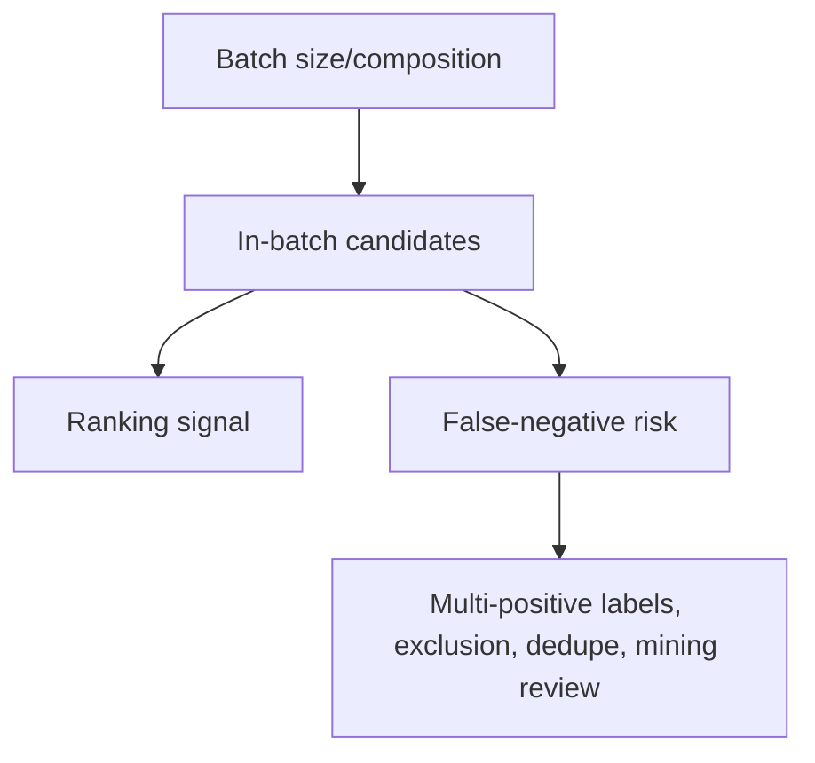

# ADR 0003: Multiple-negatives ranking loss by default

- Status: Accepted
- Decision scope: pair-training objective

## Context

Positive text pairs are relatively easy to collect, while curated explicit negatives are
costly. The default objective needs to learn retrieval ordering from pair records and execute
efficiently in the tiny CPU lifecycle.

## Decision drivers

| Driver | Importance |
|---|---|
| Operate on typed anchor-positive pairs | Required |
| Reuse batch items as negatives | High |
| Differentiable, stable cross-entropy implementation | High |
| Clear shape/label contract | High |
| Extensible to explicit negatives and other tasks | Medium |

## Decision

Use diagonal cross-entropy over the temperature-scaled `(B, B)` anchor-positive cosine matrix.

Pair batches require at least two examples. A final singleton is merged backward.

## Alternatives considered

| Objective | Appropriate data | Current position |
|---|---|---|
| Explicit InfoNCE | Positive plus negative set | Implemented loss; collator/trainer path absent |
| Triplet | Anchor/positive/negative | Implemented loss; trainer path absent |
| Cosine regression | Scored pairs | Implemented loss; trainer path absent |
| Distillation | Teacher/student embeddings | Implemented loss; trainer path absent |

The trainer fails incompatible objective/data combinations rather than silently discarding
required fields or inventing negatives.

## Consequences

More microbatch examples provide more candidates at low extra encoding cost, but batch
composition becomes part of the learning algorithm and unlabelled positives can be pushed
apart.

Gradient accumulation does not create cross-microbatch negatives. Temperature and batch size
must be evaluated together.

## Verification

Unit tests compare the loss to PyTorch cross-entropy, cover symmetric/implicit paths, and
require finite gradients. The end-to-end test trains the default objective through checkpoint
and export.

## Revisit when

Revisit if representative held-out retrieval shows another objective materially improves
quality after accounting for annotation cost, batch construction, memory, and false negatives.
