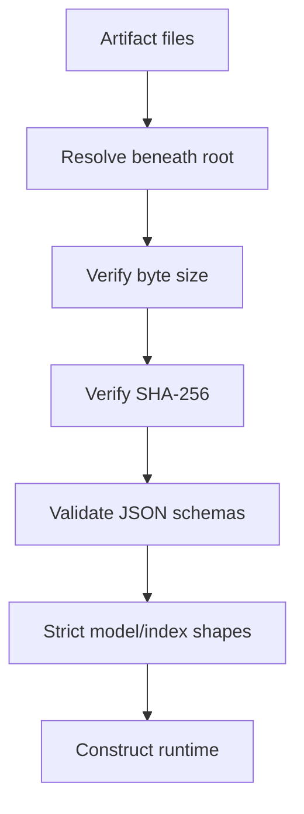
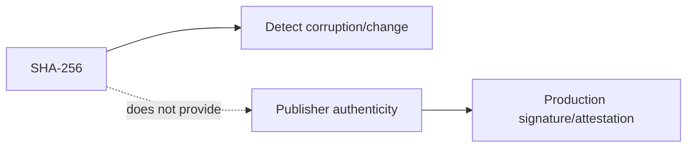

# ADR 0004: Safetensors plus checksum manifests

- Status: Accepted
- Decision scope: published model and index persistence

## Context

Artifacts cross storage and deployment trust boundaries. General pickle deserialization can
execute code, while corruption, traversal paths, schema drift, and tensor mismatch must fail
before a model or index is used.

## Decision drivers

| Driver | Importance |
|---|---|
| Non-executable published tensor format | Required |
| Inspectable configuration/tokenizer/metadata | High |
| Path containment and required-file validation | Required |
| Byte integrity and explicit schema version | Required |
| Strict tensor names/shapes and index dimensions | High |

## Decision

Publish model weights as safetensors and metadata as JSON/Markdown. Manifest every required
file with byte size and SHA-256. Persist index vectors with NumPy `allow_pickle=False` and a
separate checksummed JSON manifest.

PyTorch checkpoints remain only inside the trusted local resume boundary and load with
`weights_only=True`.

## Alternatives considered

| Alternative | Benefit | Reason not selected |
|---|---|---|
| Raw `torch.save` publication | Native complete state | Framework pickle trust/code-execution surface |
| ONNX | Cross-runtime graph | Extra operator/runtime/version surface not currently needed |
| Pickled FAISS/metadata object | Convenient | Executable/opaque persistence and weaker inspection |
| Checksums only | Detects byte change | Does not validate path/schema/tensor compatibility |

## Consequences

Artifacts are inspectable, deterministic to validate, and reject tampering before tensor use.
The format uses multiple files and explicit migrations are needed for future schema changes.

Checksums do not prevent a malicious publisher from replacing files and recomputing the
manifest. Deployment should add signed provenance and immutable storage controls.

## Verification

Tests cover missing/corrupt manifests, traversal entries, byte/size mismatch, tokenizer/config
incompatibility, tensor shape errors, index metadata/schema errors, and successful E2E reload.

## Revisit when

Revisit for signed provenance, schema migrations, quantized weights, ONNX, or another runtime,
while retaining fail-closed containment and semantic validation.
