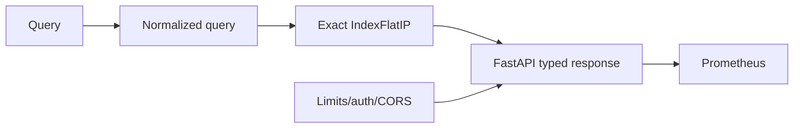
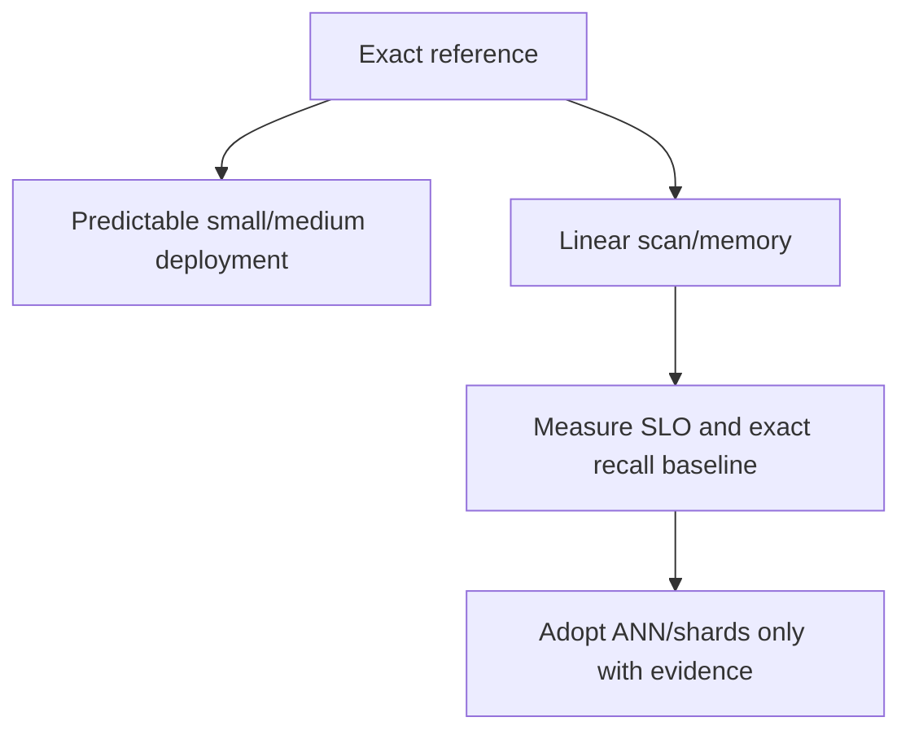

# ADR 0005: Exact FAISS-compatible search and FastAPI serving

- Status: Accepted
- Decision scope: local retrieval and HTTP interface

## Context

The reference system needs deterministic ranked retrieval plus typed HTTP endpoints, health,
limits, authentication hook, safe errors, and metrics. Standard tests must run locally without
external infrastructure.

## Decision drivers

| Driver | Importance |
|---|---|
| Exact ranking for evaluation ground truth | High |
| Cosine compatibility with normalized vectors | Required |
| Deterministic ties and safe persistence | High |
| Typed request/response validation | High |
| Dependency injection for real ASGI tests | High |

## Decision

Use normalized exact inner product (`IndexFlatIP` when FAISS is available, NumPy fallback) and
a FastAPI application factory with explicitly injected `TextEmbedder`, optional index, and
settings.

The final ranking sorts by descending score and insertion index to make ties backend
independent.

## Alternatives considered

| Alternative | Benefit | Reason not selected |
|---|---|---|
| HNSW/IVF/PQ default | Better large-scale latency/memory | Requires recall tuning and more artifact state |
| Flask | Small web core | Less integrated typed schema/OpenAPI ecosystem |
| gRPC | Strong internal RPC | Less approachable reference client surface |
| Global app/model singleton | Simple import | Hidden state, import side effects, poor test isolation |

## Consequences

Exact search is easy to reason about and provides recall ground truth, but work/memory grow
linearly with corpus size. The app is testable and bounded, but model compute is synchronous
and protected by a lock/semaphore.

Scale with immutable process replicas now; dynamic batching and ANN remain explicit future
components.

## Verification

Unit/property tests cover normalized ordering, stable ties, invalid dimensions, persistence,
and tampering. Integration/E2E tests exercise health, metrics, embeddings, similarity, search,
limits, authentication, request IDs, and safe responses.

## Revisit when

Revisit after corpus size, latency/recall SLOs, concurrency, and memory measurements justify a
different index or transport.
