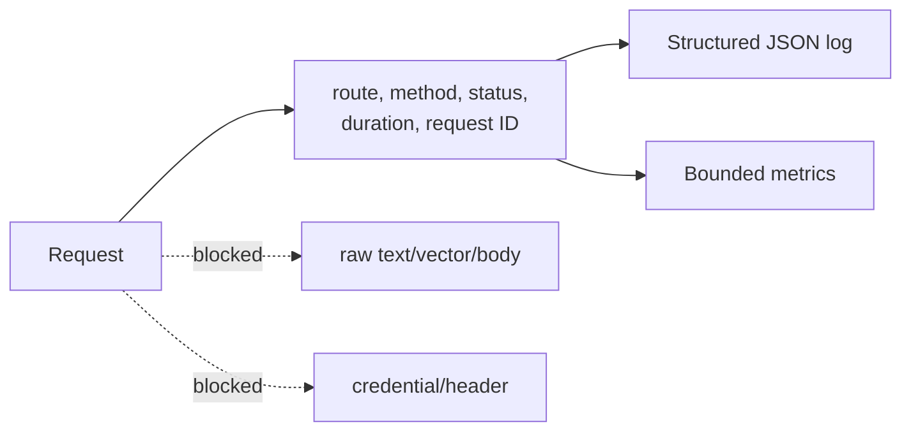
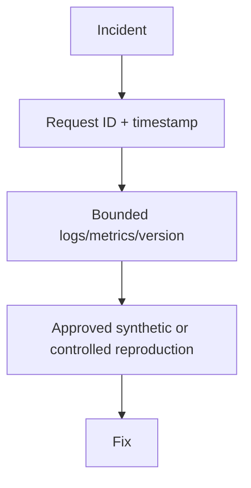

# ADR 0006: Raw text never enters logs or metric labels

- Status: Accepted
- Decision scope: operational telemetry privacy

## Context

Requests and training data may contain personal data, secrets, copyrighted content, or tenant
information. Logs are widely copied and retained, while arbitrary metric labels cause both
privacy exposure and unbounded cardinality.

## Decision drivers

| Driver | Importance |
|---|---|
| Data minimization | Required |
| Stable bounded metrics | Required |
| Incident correlation without content | High |
| Safe default under operator error | High |
| No secrets or stack traces in client responses | Required |

## Decision

Log only bounded operational metadata and request IDs. Never log raw text, vectors, request
bodies, authorization headers, or user IDs by default. Use fixed route/status/failure metric
labels and generic error codes.

Credential-like keys in explicitly supplied structured fields are recursively redacted.

## Alternatives considered

| Alternative | Benefit | Reason not selected |
|---|---|---|
| Full request debug logging | Easier reproduction | High leakage/retention/legal risk |
| Opt-in raw-text flag | Convenient during incidents | Flags drift and accidental production use |
| Hashed text labels | Apparent pseudonymization | Linkable, brute-forceable, high cardinality |
| Request ID in metric labels | Direct correlation | Unbounded time series |

## Consequences

Incident response depends on client-held context, request IDs, versioned artifacts, metrics,
and controlled reproduction. Some content-specific failures are harder to diagnose.

Redaction does not sanitize arbitrary log message strings; call sites must use allow-listed
fields and avoid interpolating untrusted values.

## Verification

Tests assert recursive secret-key redaction, absence of raw request text in logs, bounded
metric labels, generic API errors, and request-ID propagation.

## Revisit when

Only revisit for a reviewed, access-controlled, short-lived sampling design with minimization,
encryption, deletion, auditing, tenant isolation, and legal/privacy approval. The safe default
must remain content-free.
