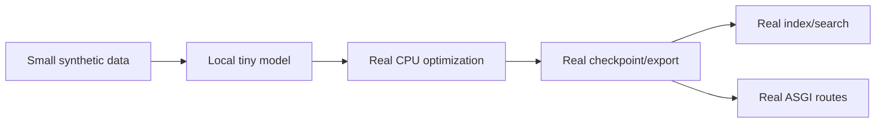
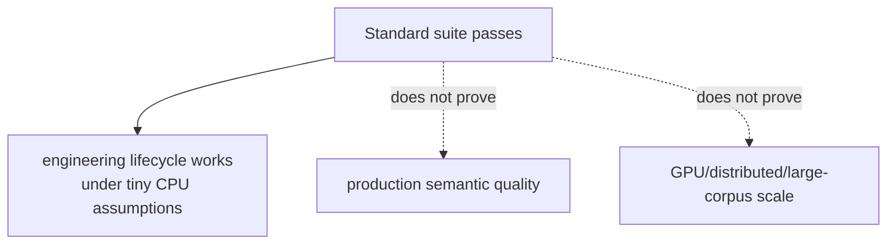

# ADR 0007: Tiny network-free models in standard tests

- Status: Accepted
- Decision scope: default continuous-integration evidence

## Context

CI must prove real training and serving behavior on ordinary CPU runners without depending on
third-party availability, mutable downloads, paid services, credentials, caches, or large
compute.

## Decision drivers

| Driver | Importance |
|---|---|
| Deterministic and CPU-compatible | Required |
| No network or private credentials | Required |
| Exercise real domain logic and persistence | Required |
| Small enough for routine CI | High |
| Clear separation of engineering and quality claims | Required |

## Decision

Use synthetic typed records, a fitted deterministic local tokenizer, and a one-layer randomly
initialized Transformer for the standard end-to-end path.

Network, GPU, large-model, and hardware-performance tests require explicit markers and suitable
runners.

## Alternatives considered

| Alternative | Benefit | Reason not selected |
|---|---|---|
| Public tiny pretrained model | Tests provider adapter and semantics | Network/cache/license/mutable artifact failures |
| Mock model outputs | Very fast | Does not prove training, shapes, serialization, or numerics |
| Large representative training | Better quality signal | Too costly and nondeterministic for standard CI |
| Remote embedding service | Minimal local runtime | Credentials, cost, privacy, availability |

## Consequences

The suite detects lifecycle regressions across real boundaries and stays hermetic. It cannot
establish semantic quality, remote-provider compatibility, GPU behavior, distributed
correctness, or production latency.

Documentation and reports must label tiny metrics as demonstrations and avoid fabricated
benchmarks.

## Verification

The E2E test trains, saves, resumes, exports, validates, loads, encodes, indexes, searches,
evaluates retrieval, and exercises the FastAPI app. Focused tests add mathematical, failure,
security, and property evidence.

## Revisit when

Add isolated integration jobs when a pinned licensed checkpoint, network policy, cache
strategy, compute budget, and explicit quality purpose are approved. Keep the hermetic standard
path even after those jobs exist.
