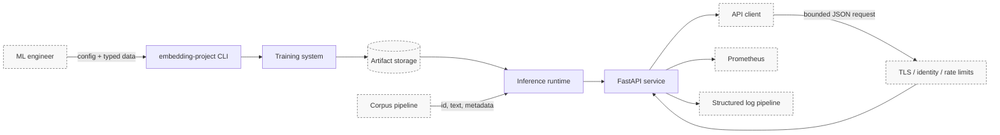
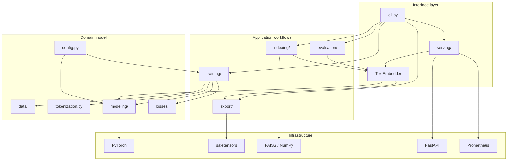
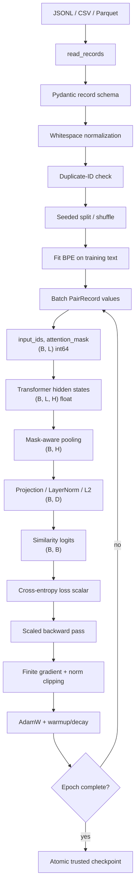
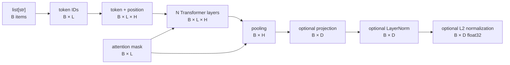
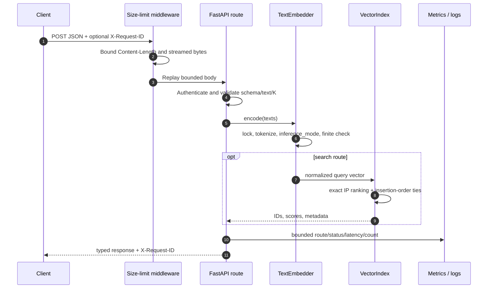
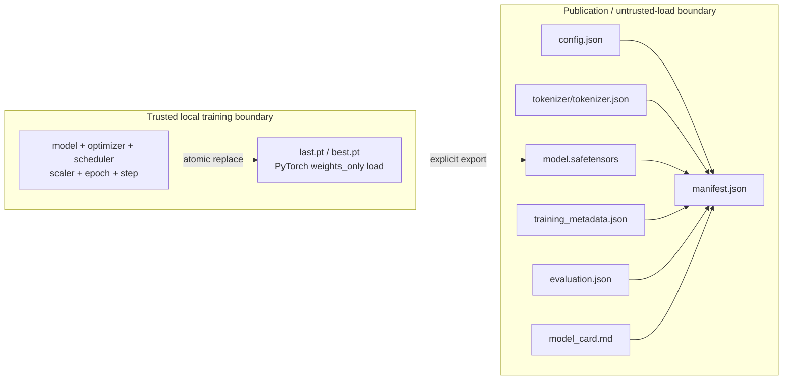
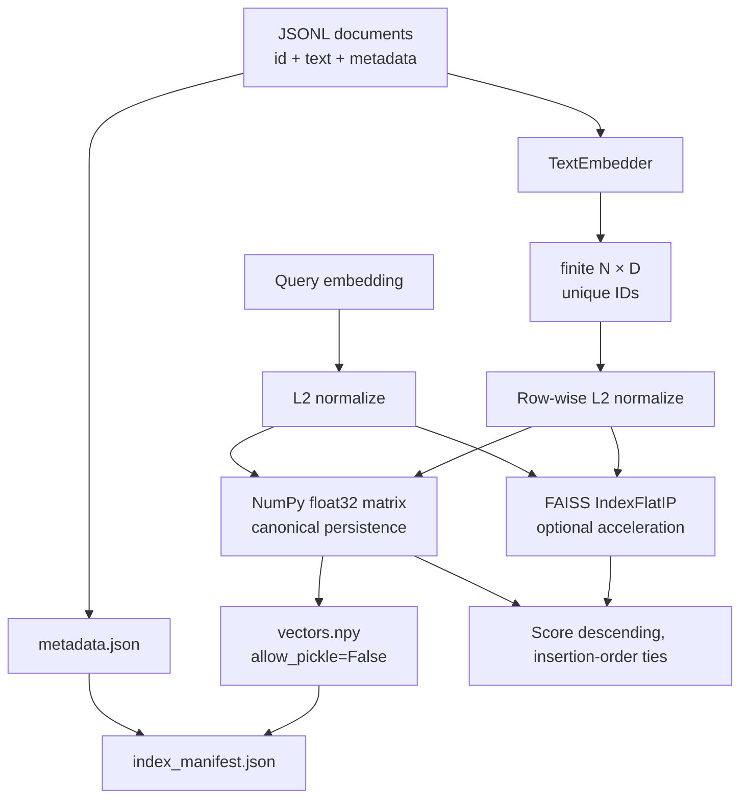
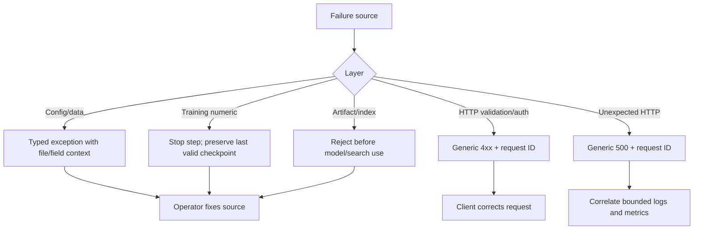

# System architecture

The project is a vertical reference system for building and operating a text-embedding model.
It deliberately keeps the standard path local and inspectable: inputs are validated, every
tensor transition has a shape contract, training state and published artifacts have different
trust rules, and serving receives already-constructed runtime objects.

## Architectural goals and boundaries

| Goal | Architectural response | Explicit boundary |
|---|---|---|
| End-to-end operability | One CLI owns train, evaluate, export, index, search, and serve | Semantic quality still depends on data/pretraining |
| Network-free CI | Local BPE and randomly initialized PyTorch Transformer | No Hugging Face download in the standard path |
| Safe publication | Safetensors plus JSON/Markdown and SHA-256 manifest | Resume checkpoints remain trusted-local files |
| Deterministic retrieval | Normalized vectors, exact inner product, insertion-order ties | Large-scale ANN is not implemented |
| Bounded serving | Strict schemas, byte/text/batch/K/concurrency limits | TLS, tenant authorization, and global rate limits live upstream |
| Testability | Dependency-injected app and tiny real lifecycle | Internal domain logic is not mocked |

The production-quality boundary matters: the system validates that a model can be trained and
operated correctly, but tiny random initialization and synthetic data do not establish useful
language understanding.

## Context diagram

External systems are shown with dashed borders. The repository supplies the CLI, training
system, artifact validation, inference runtime, index, and application. A deployment supplies
durable artifact storage, ingress security, metrics collection, and log retention.

## Container and package view

Dependencies point inward toward domain contracts. Domain modules do not import the CLI or
HTTP layer. Runtime objects are created explicitly, so importing the package does not load a
model, configure logging, touch the network, or mutate global application state.

## Training data flow

No invalid row is silently dropped. Pair training requires at least two records because a
singleton cannot provide an in-batch negative; a final singleton batch is merged backward.
See [training](training.md) for optimizer state transitions and
[contrastive learning](contrastive_learning.md) for the loss matrix.

## Tensor contract through the model

| Symbol | Meaning | Validity rule |
|---|---|---|
| `B` | Batch size | Positive inside tokenizer/model; public empty input returns `(0, D)` before model execution |
| `L` | Padded sequence length | `2 <= L <= max_sequence_length` after CLS/SEP |
| `H` | Transformer hidden width | Divisible by attention-head count |
| `D` | Public embedding dimension | Equals `H` if projection is disabled |
| Mask | `1` for active token, `0` for padding | Shape exactly matches token IDs; no fully padded row |
| Output | CPU NumPy or PyTorch tensor | Stable order, float32, finite; unit norm when enabled |

## Runtime request sequence

The semaphore bounds concurrent handlers, while the embedder lock prevents concurrent
mutation of model mode/state. Model compute is synchronous; multiple process replicas or a
dedicated dynamic batcher are deployment extensions, not hidden behavior.

## Artifact boundary

Training checkpoints and published inference artifacts solve different problems:

Loading resolves every manifest path under the artifact root, verifies schema, byte size, and
SHA-256, validates configuration and tokenizer compatibility, constructs the expected model,
then performs a strict safetensors name/shape load. A checksum detects corruption; it does not
authenticate the publisher. Production promotion should sign or attest the manifest.

## Index boundary

The model and index must agree on dimension, but dimension alone is insufficient provenance.
A production registry should promote a model, tokenizer, corpus, and index as one immutable
version. The current manifest protects index file integrity but does not embed the model hash.

## State ownership and lifecycle

| State | Owner | Mutable when | Persistence |
|---|---|---|---|
| Configuration | CLI/application construction | Never after validation | YAML input; JSON in artifact |
| Model parameters | Trainer | Training only | Checkpoint, then safetensors |
| Optimizer/scheduler/scaler | Trainer | Training only | Trusted checkpoint |
| Tokenizer vocabulary/merges | Tokenizer training | Before model construction | Checksummed JSON |
| Index vectors/metadata | Index builder | Before save or explicit append | Checksummed NumPy/JSON |
| Embedder model mode | `TextEmbedder` | Forced to evaluation under lock | Reconstructed from artifact |
| Readiness | FastAPI application state | Deployment startup/reload | Process memory |
| Metrics | Per-app Prometheus registry | Request processing | Scraped externally |

## Failure propagation

Internal exceptions are useful at CLI and test boundaries. HTTP responses deliberately avoid
exception text and stack traces because those can expose paths, configuration, or input.

## Extension seams

| Desired extension | Stable seam | Work still required |
|---|---|---|
| Pretrained encoder | Implement a model adapter preserving `(B, D)` | Tokenizer compatibility, offline fixture, licensing, evaluation |
| New training record/objective | Add typed record plus a dedicated trainer method | Collator, compatibility validation, E2E path |
| Distributed training | Trainer orchestration boundary | Samplers, rank-zero writes, gathered negatives, resume tests |
| Approximate retrieval | `VectorIndex`-compatible API | Recall benchmark, training parameters, safe persistence |
| Dynamic batching | Service-to-embedder boundary | Queue, deadlines, cancellation, queue metrics |
| Signed artifacts | Manifest promotion boundary | Signature format, key rotation, verification policy |

Architecture changes that alter these boundaries should update the relevant
[ADR](index.md#architecture-decisions), end-to-end test, traceability entry, and operational
guide together.
