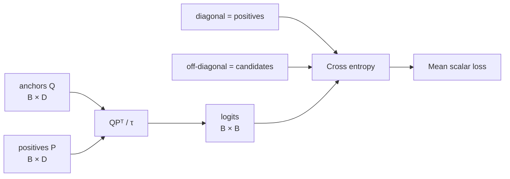
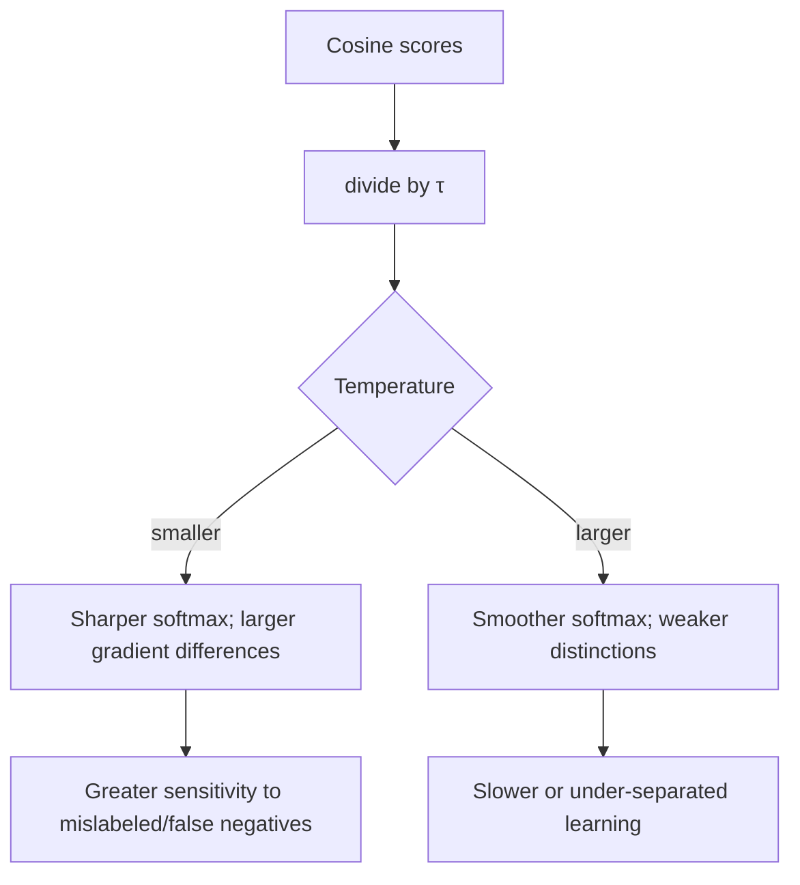
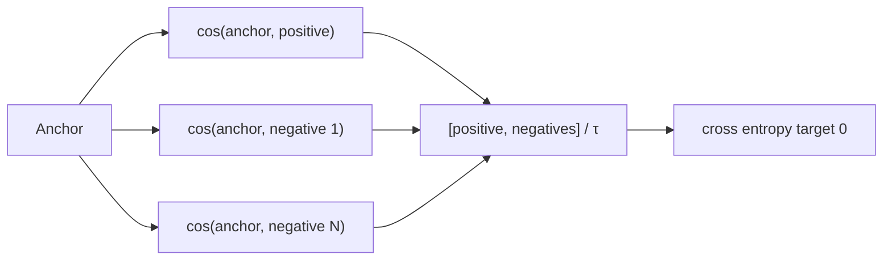
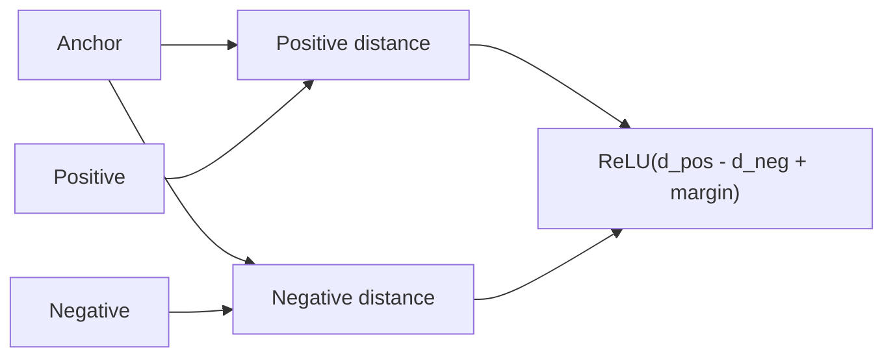
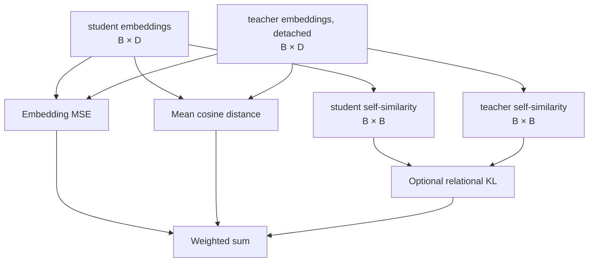
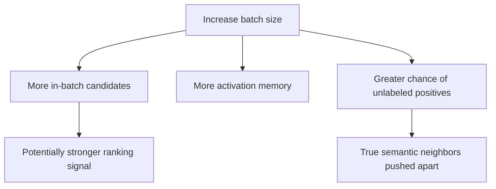

# Contrastive learning and objectives

Contrastive learning shapes the embedding space by comparing designated positives with
candidate negatives. The default pair trainer uses a batch similarity matrix: its diagonal is
positive by construction and off-diagonal pairs become in-batch candidates.

## Multiple-negatives ranking loss

For normalized anchor and positive matrices \(Q,P\in\mathbb{R}^{B\times D}\):

```text
logits[i,j] = (Q[i] · P[j]) / temperature
labels      = [0, 1, ..., B-1]
loss        = cross_entropy(logits, labels)
```



For a batch of three:

| Anchor | Candidate 0 | Candidate 1 | Candidate 2 | Target |
|---|---:|---:|---:|---:|
| `q0` | positive score | negative score | negative score | 0 |
| `q1` | negative score | positive score | negative score | 1 |
| `q2` | negative score | negative score | positive score | 2 |

The optional symmetric mode also applies cross-entropy to the transposed matrix and averages
both directions. The current trainer selects the one-direction default.

## Temperature



Temperature must be positive. It changes optimization geometry, so compare it with fixed data,
batch construction, seeds, and evaluation rather than treating it as a cosmetic scaling.

## InfoNCE with explicit negatives

With one positive and \(N\) explicit negatives per anchor:

```text
anchors   shape B × D
positives shape B × D
negatives shape B × N × D
logits    shape B × (1 + N)
target    index 0 for every row
```



When explicit negatives are omitted, the implementation delegates to multiple-negatives
ranking. The pair trainer calls this implicit path; explicit-negative dataset collation is not
wired into its public training method.

## Triplet loss

Triplet loss receives one anchor, positive, and negative per row:

```text
d_pos = 1 - cosine(anchor, positive)
d_neg = 1 - cosine(anchor, negative)
loss  = mean(max(0, d_pos - d_neg + margin))
```



Once the negative is farther than the positive by at least the margin, that triplet contributes
zero. Hard and semi-hard mining determine how often triplets remain informative.

## Cosine regression

For continuous labels \(y\in[-1,1]\):

```text
prediction = cosine(left, right)
loss       = mean((prediction - y)²)
```

This objective suits semantic textual similarity labels rather than retrieval relevance IDs.
The implementation rejects target shapes other than `(B,)` and labels outside the cosine
range.

## Distillation



Teacher tensors are detached so gradients only update the student. Non-negative component
weights must have a positive sum; relational KL uses temperature scaling.

## Objective-to-data compatibility

| Objective | Required batch fields | Implemented loss | Wired into `Trainer.train_pairs` |
|---|---|---:|---:|
| Multiple negatives | anchor, positive | Yes | Yes |
| InfoNCE implicit | anchor, positive | Yes | Yes |
| InfoNCE explicit | anchor, positive, negative set | Yes | No |
| Triplet | anchor, positive, negative | Yes | No |
| Cosine regression | left, right, score | Yes | No |
| Distillation | student input, teacher embeddings | Yes | No |

This distinction prevents a configuration from silently training the wrong task. Selecting a
non-pair objective with `PairRecord` data fails. Adding a public path requires a typed record,
collator, trainer method, checkpoint/resume coverage, CLI contract, and end-to-end test.

## Batch size and false negatives



Gradient accumulation does not enlarge the similarity matrix; each microbatch still sees only
its own negatives. Known-positive exclusion, multi-positive annotation, deduplication, and
mined-negative review are data responsibilities described in
[negative sampling](negative_sampling.md).

## Numerical and test contracts

Every objective checks tensor ranks/shapes and its own temperature, margin, target, or weight
domain. Unit tests compare small hand-computed cases, execute backward, and require finite
gradients. Training adds finite-loss and finite-gradient-norm checks before the optimizer step.
These checks establish mathematical execution, not model quality; held-out retrieval evidence
remains mandatory.
