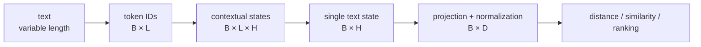
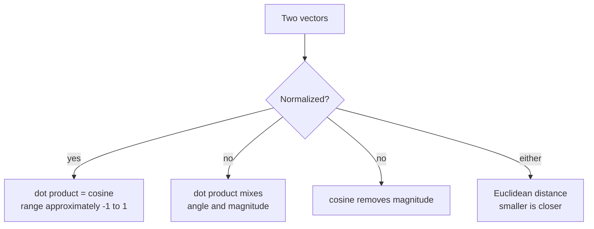
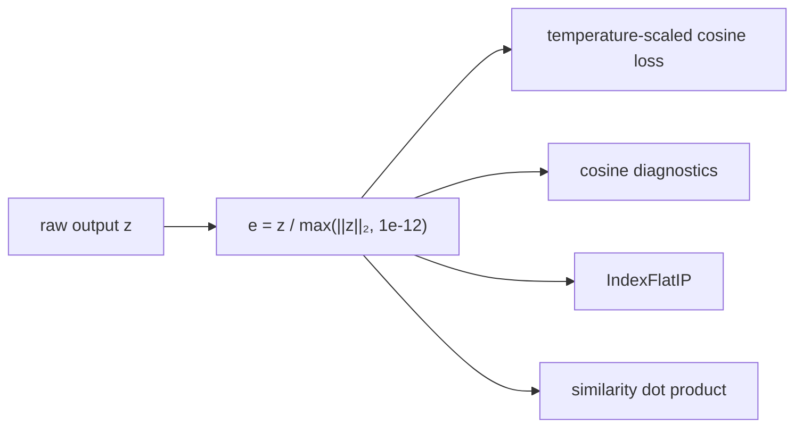
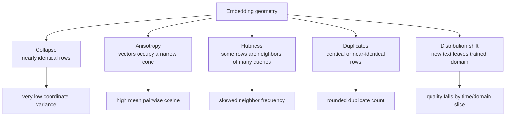
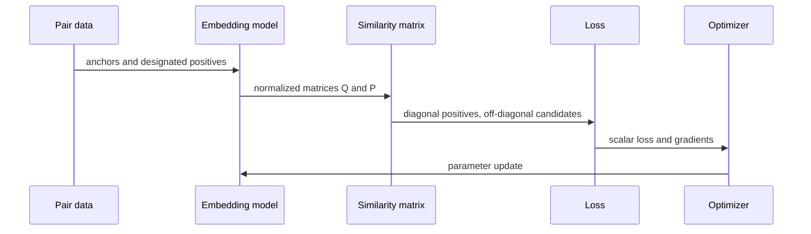

# Embedding fundamentals

An embedding model maps variable-length text to a fixed-width numeric vector. The vector is
not a symbolic meaning, fact database, or causal representation; it is a learned position in
a space whose geometry is useful only to the extent that the training objective and data make
it useful for the target task.

## From text to geometry



The public model contract is a matrix \(E\in\mathbb{R}^{B\times D}\), where rows preserve
input order. The repository returns `float32`, rejects non-finite model output, and produces
unit-length rows by default. An empty public input does not run the model; it returns shape
`(0, D)`.

## Sparse and dense representations

| Property | TF-IDF | Learned dense embedding |
|---|---|---|
| Coordinate meaning | Explicit vocabulary feature | Distributed learned feature |
| Typical width | Vocabulary-sized | Configured `embedding_dimension` |
| Context sensitivity | Mostly lexical counts | Contextual token interactions |
| Training need | Corpus statistics | Encoder plus supervised/self-supervised objective |
| Strength | Exact term overlap, interpretable | Potential semantic generalization |
| Failure mode | Vocabulary mismatch | Data bias, collapse, anisotropy, weak pretraining |

TF-IDF is not merely a toy competitor: a weak encoder can lose to it on lexical retrieval.
The evaluation layer therefore exposes TF-IDF and seeded random vectors as honest baselines.

## Similarity and distance

For \(x,y\in\mathbb{R}^{D}\):

```text
dot(x, y)       = Σᵢ xᵢyᵢ
cos(x, y)       = dot(x, y) / max(||x||₂ ||y||₂, ε)
euclidean(x, y) = sqrt(Σᵢ(xᵢ-yᵢ)²)
```



Cosine evaluates direction. Dot product evaluates direction and length. Euclidean distance
evaluates straight-line separation. For normalized vectors:

```text
||x - y||₂² = ||x||₂² + ||y||₂² - 2x·y = 2 - 2 cos(x, y)
```

Therefore cosine, inner product, and Euclidean distance induce equivalent ordering when every
row is unit length. The project uses normalized inner product because FAISS `IndexFlatIP`
implements it directly.

## Why normalization is a system contract



Normalization is not an isolated model preference. Training loss, API similarity, and search
ranking all rely on the same geometry. Disabling it is supported at model/encoding boundaries,
but callers must then choose an appropriate similarity and must not assume inner product is
cosine.

## Dimension, capacity, and cost

For \(N\) float32 corpus vectors of width \(D\), the raw matrix costs approximately:

```text
storage bytes = N × D × 4
exact query multiply-add work ≈ N × D
```

| Change | Possible benefit | Cost or risk |
|---|---|---|
| Increase `D` | More representational capacity | More parameters, index memory, bandwidth, search work |
| Decrease `D` | Smaller/faster artifacts and index | Information bottleneck and possible ranking loss |
| Add projection `H -> D` | Decouple encoder width from public width | Extra learned parameters |
| Add output LayerNorm | Adjust coordinate statistics | Changes exported weights and geometry |

Dimension is a measured design choice, not a monotonic quality knob. Any change invalidates
the existing index and must be evaluated on representative retrieval data.

## Geometry failure modes



`embedding_diagnostics` reports count, dimension, norm mean/min/max, mean coordinate
variance, rounded duplicate count, mean pairwise cosine, and a conservative collapse flag.
Those statistics are indicators, not a substitute for relevance judgments.

## How geometry is learned



The model does not receive a universal definition of meaning. It learns to increase the
relative score of supplied positives against available negatives. False positives, false
negatives, duplicated records, leakage, and narrow domains directly reshape the space.

## Evidence required before use

Training loss proves optimizer progress, not retrieval usefulness. A defensible assessment
combines:

1. versioned held-out queries, corpus, and multiple relevance judgments;
2. Recall/Precision/MRR/MAP/NDCG/Hit Rate at operational cutoffs;
3. STS correlation where continuous similarity labels are relevant;
4. geometry diagnostics and positive-negative score separation;
5. TF-IDF, random, and untrained-encoder baselines;
6. domain/time/language slices and qualitative nearest-neighbor review;
7. latency, memory, and index-size measurements on deployment hardware.

Continue with [Transformer fundamentals](transformer_fundamentals.md) for how token states
are produced and [evaluation](evaluation.md) for how geometry is measured.
