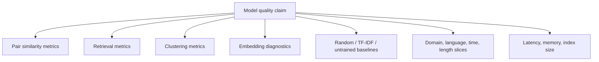
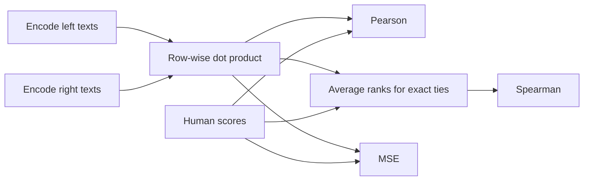
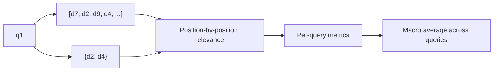
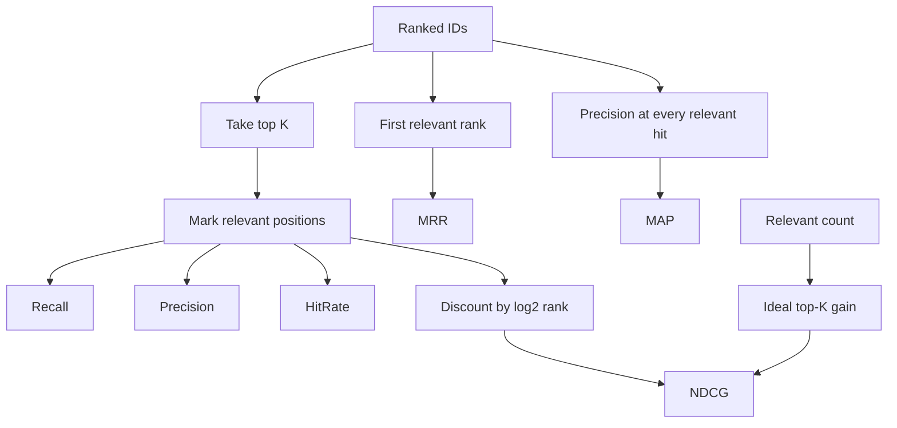
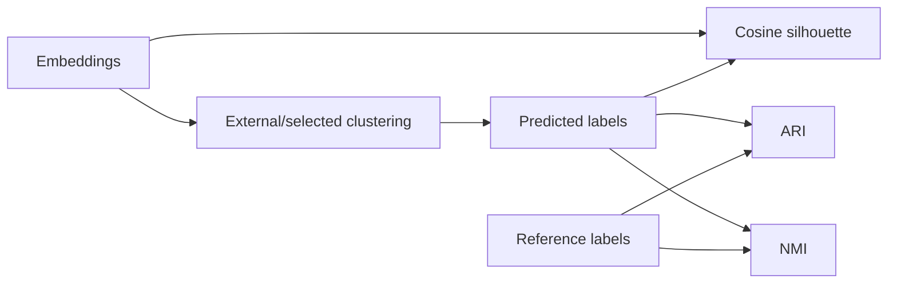
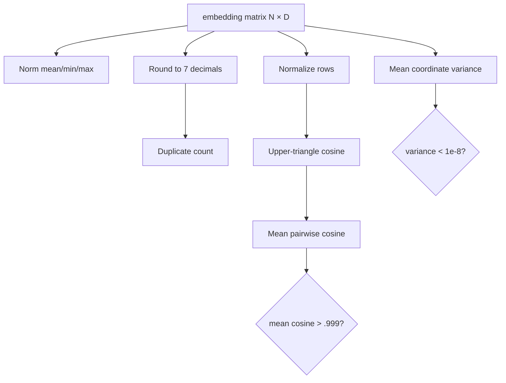
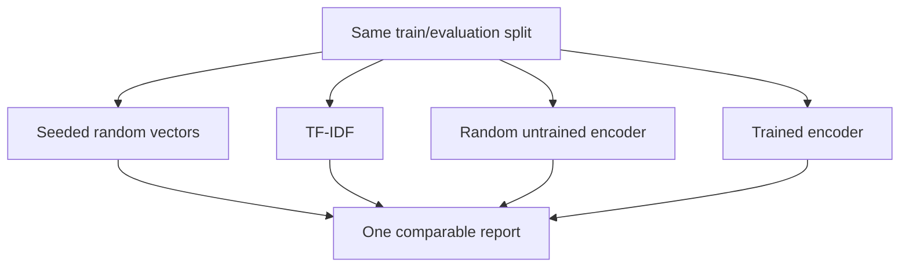
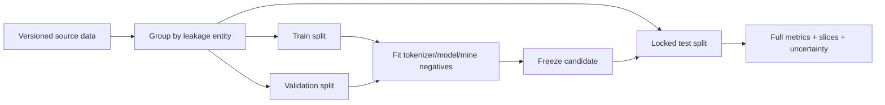

# Evaluation

Evaluation asks separate questions about pairwise similarity, retrieval ranking, clustering,
and geometry. No single score proves model quality, and training loss is not an evaluation
metric.

## Evaluation evidence stack



Use the layers relevant to the product, but always include a held-out task metric, a baseline,
and diagnostics capable of exposing degenerate geometry.

## Semantic textual similarity

Given predictions \(p_i\) and labels \(y_i\):

| Metric | Question | Better |
|---|---|---|
| Pearson | Is there a linear association? | Closer to 1 |
| Spearman | Is ordering monotonic? | Closer to 1 |
| MSE | How large are absolute score errors? | Closer to 0 |

```text
Pearson(p,y) = Σ(p-p̄)(y-ȳ) / sqrt(Σ(p-p̄)² Σ(y-ȳ)²)
MSE(p,y)     = mean((p-y)²)
Spearman     = Pearson(average_rank(p), average_rank(y))
```



Inputs must be finite equal-length one-dimensional arrays of at least two items. Correlation
with a constant input is undefined and fails explicitly instead of returning a misleading
zero.

## Retrieval data model

Retrieval evaluation uses:

- a mapping from every `query_id` to a ranked sequence of unique document IDs;
- a mapping from the same query IDs to a non-empty set of relevant document IDs;
- one or more positive cutoffs \(K\).



Ranking input order is the tie breaker. `VectorIndex` makes tied scores deterministic by
insertion order before the evaluator sees them.

## Retrieval metrics with multiple positives

Let the relevant set be `{B, D}` and ranking be `[A, B, C, D]`.

| Metric | Definition | Worked value at K=3 |
|---|---|---:|
| Recall@K | relevant retrieved / all relevant | `1 / 2 = 0.5` |
| Precision@K | relevant retrieved / K | `1 / 3` |
| Hit Rate@K | at least one relevant in top K | `1` |
| MRR | reciprocal rank of first relevant | `1 / 2` |
| AP | sum precision at each relevant hit / all relevant | `((1/2)+(2/4))/2 = 0.5` |
| NDCG@K | discounted gain / ideal discounted gain | binary log-discounted ratio |



Precision divides by the requested K even if fewer results are supplied. AP divides by all
relevant documents, so unretrieved positives reduce the score. Query metrics are
macro-averaged, giving each query equal weight.

## Clustering metrics

| Metric | Labels needed | Interpretation |
|---|---:|---|
| Cosine silhouette | Cluster assignments | Cohesion versus nearest other cluster |
| Adjusted Rand Index | Reference and predicted labels | Pair agreement corrected for chance |
| Normalized Mutual Information | Reference and predicted labels | Shared information normalized to `[0,1]` |



The project computes metrics; it does not assert that cluster labels correspond to semantic
truth. Ensure enough samples and at least two valid clusters.

## Geometry diagnostics



The collapse flag is conservative and intentionally simple. Positive-negative separation adds
positive mean, negative mean, and their gap. Always inspect distributions; a positive mean gap
can hide bad tails or important slices.

## Baselines



Random catches metric/pipeline bugs, TF-IDF establishes lexical strength, and the untrained
encoder estimates improvement attributable to training. Keep preprocessing, corpus, relevance,
and cutoffs fixed.

## Experimental design and leakage

Split by the entity that could leak, not merely by row. Near-duplicate texts, repeated queries,
documents shared between pair and retrieval sets, tokenizer fitting choices, and hard-negative
mining from held-out judgments can all inflate results.



For consequential comparisons, report bootstrap confidence intervals or repeated-seed
variation, define the primary metric before testing, and do not cherry-pick K or slices after
seeing results.

## CLI path

```bash
make evaluate-tiny

embedding-project evaluate \
  --model-path artifacts/model-tiny \
  --data data/sample_scored_pairs.jsonl \
  --output artifacts/evaluation.json
```

The current CLI evaluates scored pairs with Pearson, Spearman, MSE, and embedding diagnostics.
Retrieval and clustering functions are public Python APIs and are exercised by tests, but do
not yet have dedicated CLI subcommands. Any values from tiny synthetic data are demonstration
results only.
