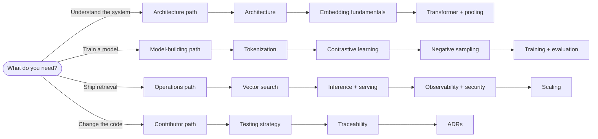
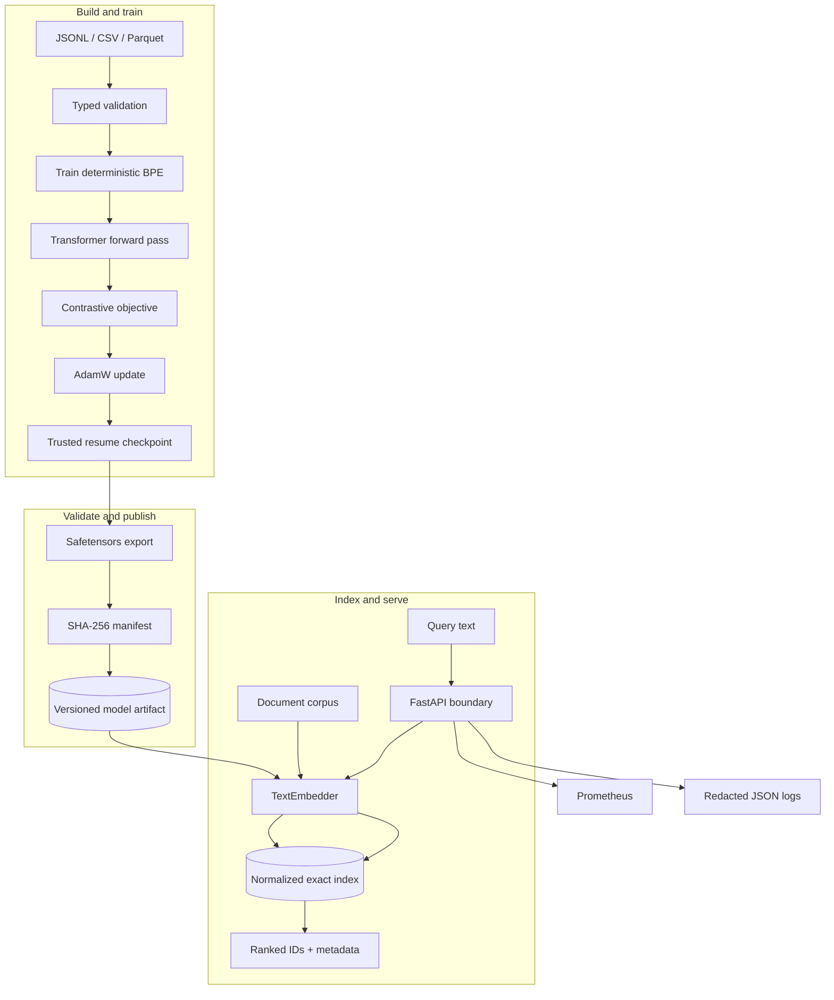
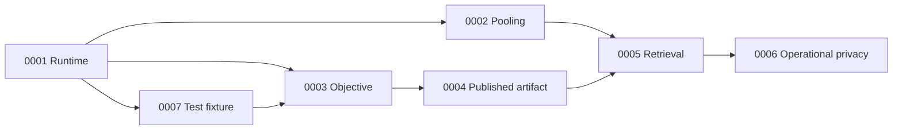

# Documentation guide

This documentation explains how the repository is assembled into a complete text-embedding
system: data enters as validated records, a local tokenizer and Transformer turn text into
vectors, objectives shape their geometry, artifacts cross a safety boundary, and an exact
index and HTTP service expose retrieval. The tiny workflow demonstrates that lifecycle on a
CPU without claiming that random initialization produces a production-quality language model.

## Choose a reading path

| Reader | Start here | Then read | Outcome |
|---|---|---|---|
| New engineer | [Architecture](architecture.md) | Fundamentals and lifecycle guides | Understand boundaries, shapes, and ownership |
| ML practitioner | [Embedding fundamentals](embedding_fundamentals.md) | Tokenization, losses, training, evaluation | Understand the learning problem and quality evidence |
| Platform engineer | [Inference and serving](inference_and_serving.md) | Search, observability, security, scaling | Operate a version-compatible model/index service |
| Security reviewer | [Security](security.md) | Artifacts in architecture, serving, observability | Trace untrusted bytes through validation boundaries |
| Contributor | [Testing strategy](testing_strategy.md) | Traceability and ADRs | Change behavior without breaking lifecycle guarantees |
| Incident responder | [Troubleshooting](troubleshooting.md) | Observability and the affected subsystem | Diagnose from symptoms without exposing raw text |

## System in one picture

The arrows represent real boundaries exercised by the end-to-end test. There is no remote
model download, hidden singleton, or import-time model load in the standard path.

## Concepts and model internals

- [Embedding fundamentals](embedding_fundamentals.md) develops vector geometry, cosine
  similarity, normalization, anisotropy, hubness, and collapse.
- [Transformer fundamentals](transformer_fundamentals.md) follows tensors through token and
  position embeddings, self-attention, feed-forward blocks, residuals, and masking.
- [Tokenization](tokenization.md) explains deterministic Unicode-character BPE, ordered
  merges, special IDs, padding, truncation, and model/tokenizer compatibility.
- [Pooling](pooling.md) compares mask-aware mean, CLS, max, and mean-square-root-length
  pooling with worked tensor examples.
- [Contrastive learning](contrastive_learning.md) derives all five implemented losses and
  states which ones the pair trainer currently wires into the CLI.

## Training and evaluation lifecycle

- [Negative sampling](negative_sampling.md) compares random, in-batch, lexical,
  embedding-hard, and semi-hard candidates and explains false-negative controls.
- [Training](training.md) follows one batch through batching, accumulation, mixed precision,
  clipping, scheduling, checkpoints, resume, validation, and early stopping.
- [Evaluation](evaluation.md) derives similarity, retrieval, clustering, and geometry
  diagnostics, including multiple relevance judgments and deterministic ties.
- [Traceability](traceability.md) maps requirements to source modules, tests, evidence, and
  known limits.

## Retrieval and production lifecycle

- [Vector search](vector_search.md) explains normalization, `IndexFlatIP`, deterministic
  ranking, persistence, compatibility, and the exact-to-approximate migration boundary.
- [Inference and serving](inference_and_serving.md) documents `TextEmbedder`, every HTTP
  route, request flow, limits, authentication, readiness, and deployment topology.
- [Observability](observability.md) maps service and training events to metrics, structured
  logs, alerts, and privacy-safe incident context.
- [Security](security.md) provides assets, threat actors, trust boundaries, abuse cases,
  controls, residual risks, and deployment responsibilities.
- [Scaling](scaling.md) separates training, encoding, indexing, and serving bottlenecks and
  shows when replication, batching, sharding, or ANN becomes justified.
- [Troubleshooting](troubleshooting.md) supplies symptom-to-layer decision trees and
  evidence-preserving recovery procedures.
- [Testing strategy](testing_strategy.md) explains the test pyramid, marker matrix,
  deterministic fixtures, security tests, performance evidence, and verification order.

## Architecture decisions

Architecture Decision Records explain why the current shape was chosen and when to revisit it:

1. [PyTorch and a local Transformer](adr/0001-pytorch-local-transformer.md)
2. [Masked mean pooling](adr/0002-mean-pooling.md)
3. [Multiple-negatives ranking loss](adr/0003-contrastive-loss.md)
4. [Safetensors and checksum manifests](adr/0004-safe-artifacts.md)
5. [Exact FAISS-compatible search and FastAPI](adr/0005-faiss-fastapi.md)
6. [No raw text in logs or metric labels](adr/0006-no-raw-text-logging.md)
7. [Tiny network-free standard tests](adr/0007-tiny-network-free-tests.md)

## Repository-to-document map

| Repository area | Primary guide | Public contract |
|---|---|---|
| `src/embedding_model/config.py` | [Architecture](architecture.md) | Unknown keys and invalid combinations fail |
| `data/` | [Negative sampling](negative_sampling.md) | Typed records; no silent row dropping |
| `tokenization.py` | [Tokenization](tokenization.md) | Stable special IDs and ordered serialization |
| `modeling/` | [Transformer](transformer_fundamentals.md), [pooling](pooling.md) | Finite `(B, D)` output |
| `losses/` | [Contrastive learning](contrastive_learning.md) | Differentiable, shape-checked objectives |
| `training/` | [Training](training.md) | Deterministic local checkpoint/resume |
| `export/` | [Architecture](architecture.md#artifact-boundary) | Non-executable weights and verified manifest |
| `evaluation/` | [Evaluation](evaluation.md) | Explicit ties, aggregation, and invalid states |
| `indexing/` | [Vector search](vector_search.md) | Normalized exact ranking and safe persistence |
| `inference/` and `serving/` | [Inference and serving](inference_and_serving.md) | Stable encoding and bounded HTTP requests |
| `tests/` and `.github/` | [Testing strategy](testing_strategy.md) | CPU-first, network-free standard verification |

## Scope boundary

The repository proves engineering correctness for a small local model. It does not include a
pretrained encoder adapter, masked-language-model pretraining pipeline, distributed trainer,
approximate index, dynamic batching scheduler, tenant identity system, or TLS termination.
The relevant guides mark those as explicit extension points instead of describing them as
implemented behavior.
