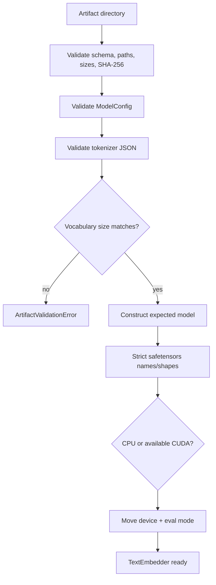
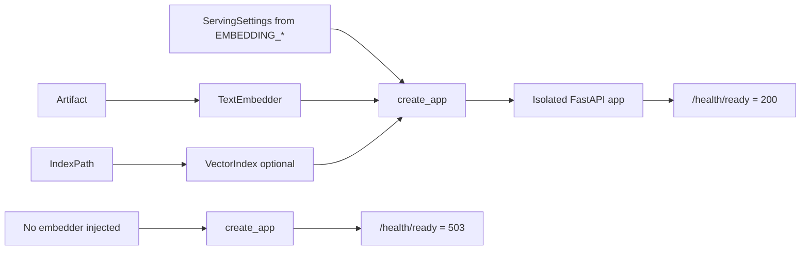
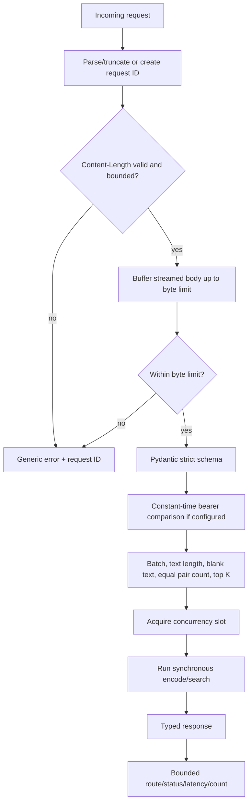
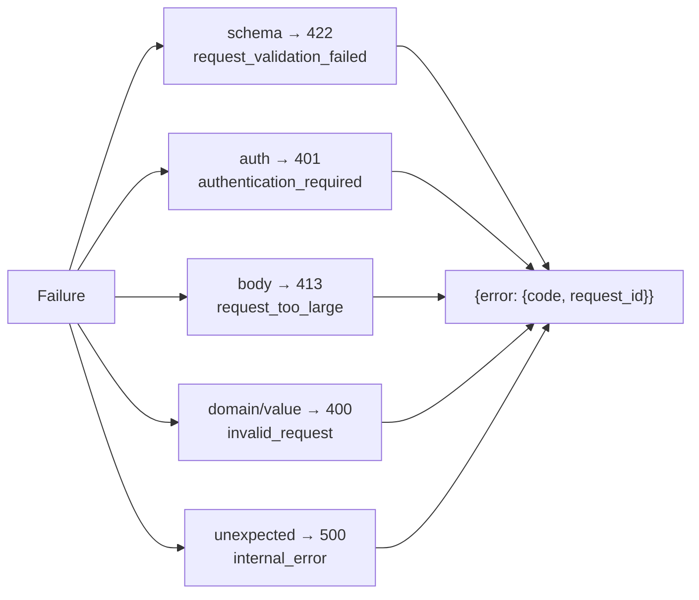
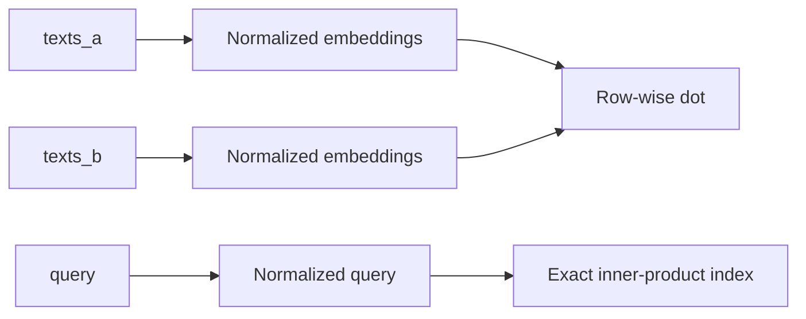
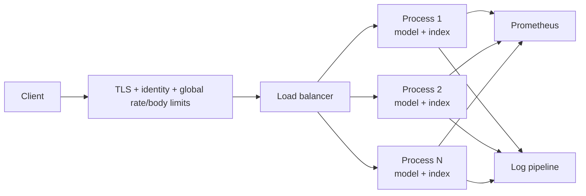

# Inference and serving

Inference has two boundaries. `TextEmbedder` is the stable Python API that loads and encodes a
verified artifact. `create_app` wraps an injected embedder and optional index with bounded HTTP
contracts, health, authentication, metrics, request IDs, and safe errors.

## Python inference lifecycle



No executable pickle is used for published inference weights. CUDA requests fail if CUDA is
unavailable rather than silently changing the requested deployment.

## `TextEmbedder.encode`

```mermaid
sequenceDiagram
    autonumber
    participant Caller
    participant E as TextEmbedder
    participant T as Tokenizer
    participant M as EmbeddingModel

    Caller->>E: str or iterable[str], batch_size, normalize
    E->>E: materialize once; validate types
    alt empty iterable
        E-->>Caller: float32 shape 0 × D
    else non-empty
        E->>E: acquire re-entrant lock and inference_mode
        loop chunks in stable order
            E->>T: batch_encode
            T-->>E: IDs and mask
            E->>M: forward(normalize override)
            M-->>E: finite B × D tensor
        end
        E->>E: concatenate on CPU as float32
        E-->>Caller: NumPy by default or PyTorch tensor
    end
```

| Input/option | Contract |
|---|---|
| Single string | Treated as one text, output `(1, D)` |
| Iterable of strings | Materialized once and order preserved |
| Empty iterable | Valid output `(0, D)` |
| `batch_size` | Positive integer |
| `normalize=None` | Use artifact default |
| `normalize=True/False` | Explicit per-call override |
| `convert_to_tensor=False` | CPU NumPy `float32` |
| `convert_to_tensor=True` | CPU PyTorch `float32` |

The lock ensures callers cannot race model mode/state. It also serializes inference within one
embedder, which is safe but limits single-process concurrency.

## Service construction and readiness



Each app receives its own Prometheus registry, state, semaphore, and dependencies. Liveness
means the process can answer; readiness means an embedder is injected. Search readiness is
route-specific: `/v1/search` fails safely if no index is loaded.

## Route contracts

| Method and route | Authentication | Purpose | Important response fields |
|---|---:|---|---|
| `GET /health/live` | No | Process liveness | `status` |
| `GET /health/ready` | No | Model readiness | `ready`, HTTP 200/503 |
| `GET /version` | No | Package version | `version` |
| `GET /v1/model` | No | Runtime model contract | name, dimension, max length, pooling, normalized default |
| `GET /metrics` | No | Prometheus exposition | bounded service metrics |
| `POST /v1/embeddings` | Optional bearer hook | Encode batch | model, dimension, count, embeddings |
| `POST /v1/similarity` | Optional bearer hook | Pairwise normalized dot scores | count, similarities |
| `POST /v1/search` | Optional bearer hook | Encode query and search index | count, IDs, scores, metadata |

Pydantic request models reject unknown fields. Authentication protects model-work routes only
in the current app; ingress policy should additionally decide exposure of metadata and metrics.

## Request safeguard pipeline



Both declared `Content-Length` and chunked bodies are bounded. The body middleware replays only
the accepted buffered request. The application does not log request bodies or exception text.

## Serving settings

Environment variables use the `EMBEDDING_` prefix:

| Variable | Default | Validated range/purpose |
|---|---:|---|
| `EMBEDDING_MAX_BATCH_SIZE` | 64 | 1–2048 texts per handler |
| `EMBEDDING_MAX_TEXT_LENGTH` | 4096 | 1–1,000,000 characters per text |
| `EMBEDDING_MAX_REQUEST_BYTES` | 1,000,000 | At least 1024 bytes |
| `EMBEDDING_MAX_TOP_K` | 100 | 1–10,000 |
| `EMBEDDING_CONCURRENCY_LIMIT` | 4 | 1–1024 in-flight model handlers |
| `EMBEDDING_AUTH_TOKEN` | unset | Optional bearer secret |
| `EMBEDDING_CORS_ORIGINS` | empty | Explicit allowed origins |

Text character limits and token truncation are different controls: the first protects request
resources, while the second bounds Transformer sequence length.

## Error model



Responses contain no stack trace, path, raw text, secret, or exception message. Operators
correlate the request ID with bounded structured logs and metrics.

## Similarity and search semantics

`/v1/similarity` requires equal list lengths, encodes both sides with the artifact default, and
uses row-wise dot products. This equals cosine only because default output is normalized.
`/v1/search` validates K against both the schema (`>=1`) and configured maximum, encodes one
query, and returns deterministic exact ranking.



## Deployment topology



The CLI intentionally launches one Uvicorn process:

```bash
embedding-project serve \
  --model-path artifacts/model-tiny \
  --index-path artifacts/index-tiny \
  --host 127.0.0.1 \
  --port 8000
```

Replicate immutable processes externally. Async route syntax does not make PyTorch kernels
parallel; a real dynamic batcher needs a bounded queue, short deadline-aware batching window,
cancel handling, and queue metrics.

## Example requests

```bash
curl -sS http://127.0.0.1:8000/v1/embeddings \
  -H 'Content-Type: application/json' \
  -d '{"texts":["blue ocean","green forest"],"normalize":true}'

curl -sS http://127.0.0.1:8000/v1/search \
  -H 'Content-Type: application/json' \
  -d '{"query":"ocean color","top_k":3}'
```

When authentication is configured, add `Authorization: Bearer ...` without placing the token
in command history, source files, or logs. See [security](security.md) and
[observability](observability.md) before exposing the service beyond a development network.
