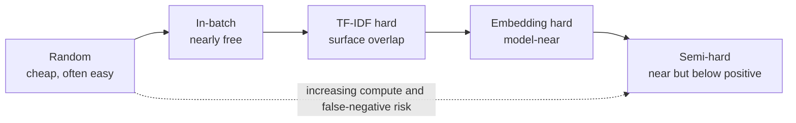
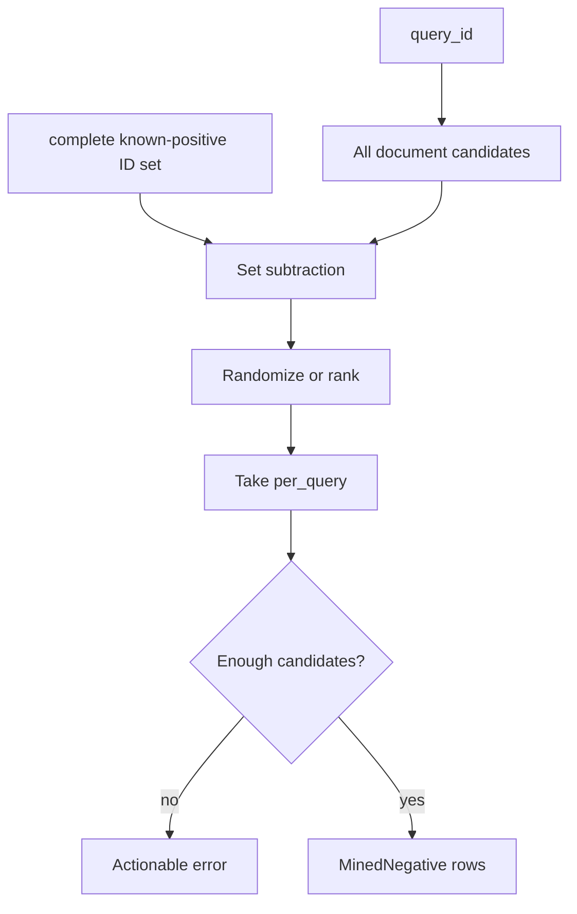
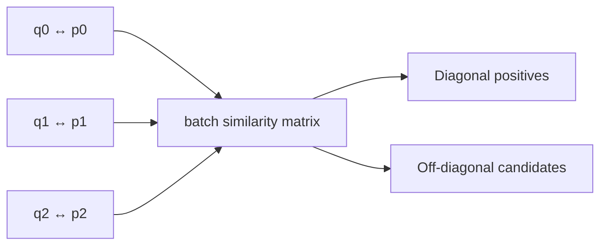
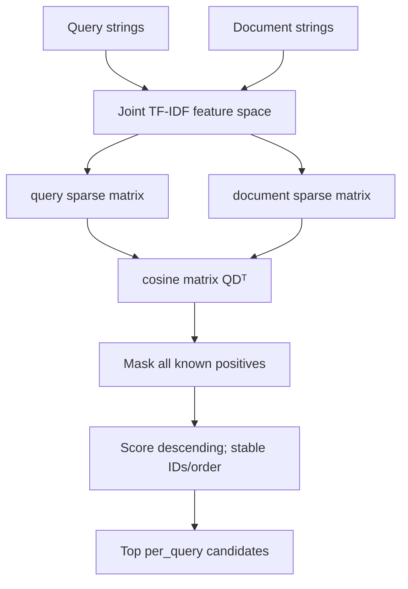
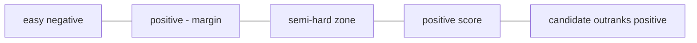
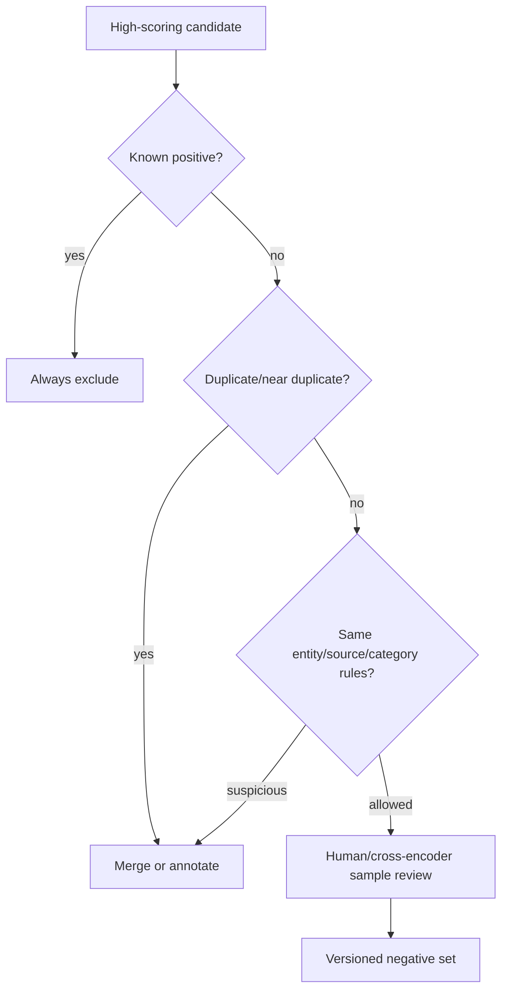
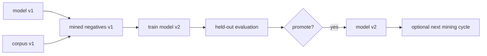

# Negative sampling

A negative is a candidate the objective should rank below a positive. Negative selection
determines what distinctions the model learns: trivial negatives contribute little gradient,
while false negatives actively teach the wrong geometry.

## Candidate spectrum



| Strategy | Inputs | Selection rule | Primary risk |
|---|---|---|---|
| Random | document IDs, positive map, seed | Seeded sample after exclusion | Too easy |
| In-batch | current pair batch | Other positives become candidates | Unlabelled cross-pair positives |
| Lexical hard | query/document text | Descending TF-IDF cosine | Surface overlap may imply relevance |
| Embedding hard | query/document vectors | Descending normalized cosine | Current model bias and stale vectors |
| Semi-hard | positive and candidate scores | Below positive but within margin | Score calibration and missing positives |

## Exclusion is the first invariant



Every miner receives the complete known-positive set for each query. It validates that query
and positive IDs exist, removes every known positive before ranking, uses deterministic
tie/order rules, and refuses impossible requests rather than silently returning biased rows.
This protects labelled positives only; missing relevance judgments remain a data problem.

## Random and in-batch negatives

Random sampling establishes a cheap diversity baseline and is reproducible under the supplied
seed. In-batch negatives require no extra encoder pass:



Larger microbatches add off-diagonal candidates. Gradient accumulation does not: separately
accumulated microbatches never share a similarity matrix in the current trainer.

## Lexical hard-negative mining



The CLI exposes this path:

```bash
embedding-project mine-negatives \
  --queries data/sample_queries.jsonl \
  --documents data/sample_documents.jsonl \
  --output artifacts/mined-negatives.jsonl \
  --per-query 1
```

Query JSONL requires `query_id`, `query`, and non-empty `positive_ids`; document JSONL requires
`id` and `text`. Output contains query ID, document ID, and score, not copied raw text.

## Embedding-hard and semi-hard mining

Embedding mining L2-normalizes query/document rows and ranks their inner products. It checks
shape, finiteness, ID count, uniqueness, and positive exclusions.

Semi-hard selection keeps candidates satisfying:

```text
positive_score - margin < negative_score < positive_score
```



Candidates above the positive may be useful hard examples, annotation errors, or genuine
unlabelled positives. Review them before training.

## False-negative controls



Useful controls include multi-positive annotation, canonical-ID deduplication, source-aware
rules, conservative score bands, cross-encoder or human review, and auditing the hardest
tail. No algorithm can exclude relevance labels the dataset never records.

## Refresh and provenance

Version the query set, corpus, relevance judgments, tokenizer/model, miner configuration,
random seed, and output together.



Refreshing after every tiny change can destabilize the target distribution; never mix vectors
from a different model version without recording it. Always evaluate the resulting model on
held-out relevance data rather than using mining score as quality evidence.
