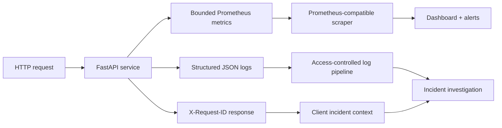
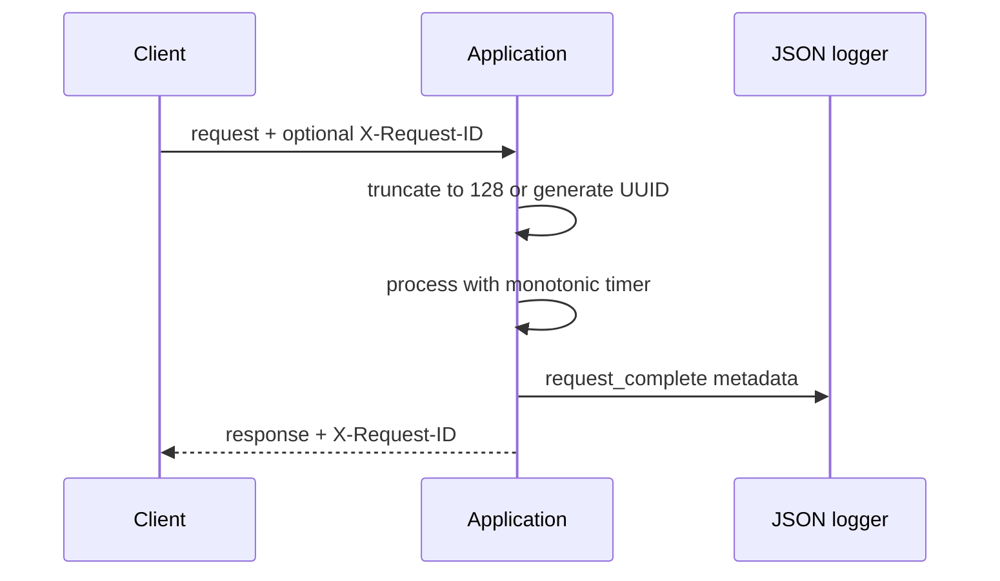
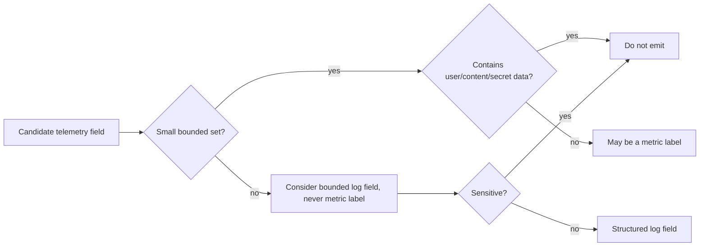
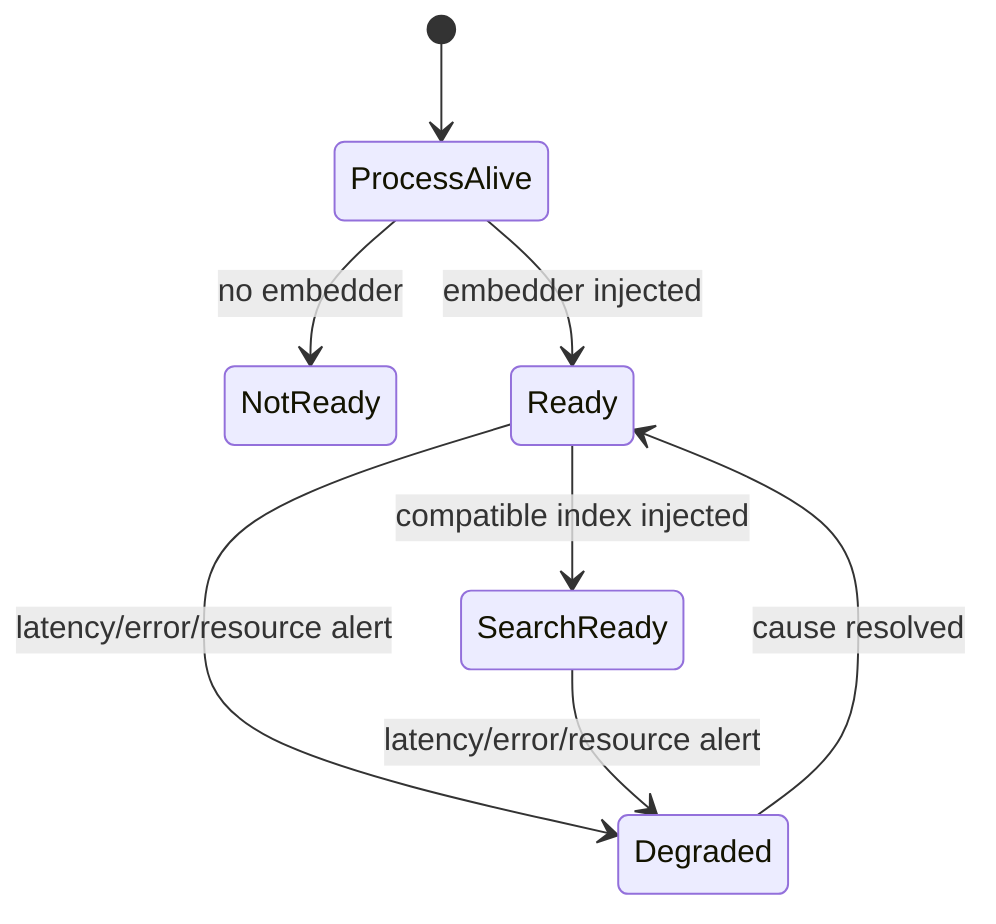
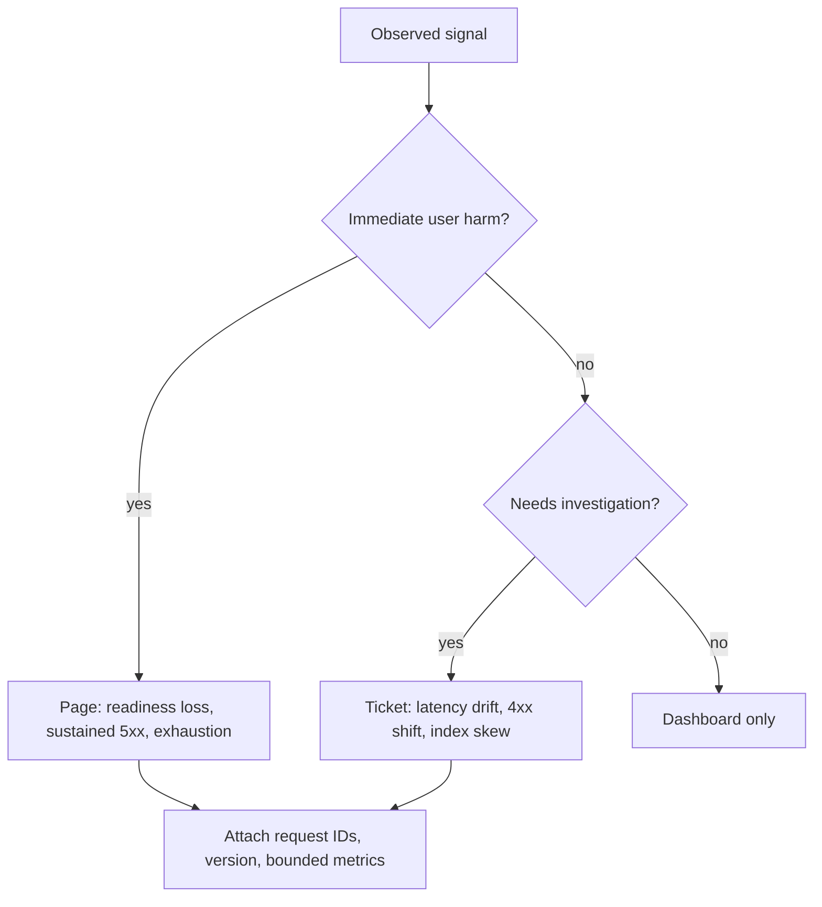
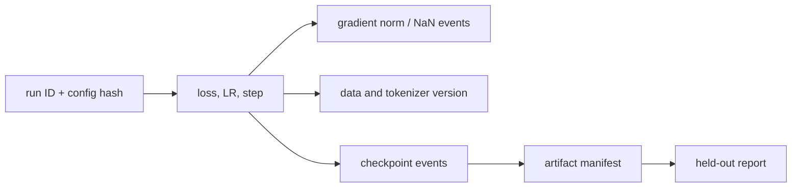

# Observability

Observability explains whether the embedding service is available, safe, fast, and returning
results from the intended model/index version without copying user text into telemetry. The
implemented layer provides per-application Prometheus metrics, JSON logs, and request IDs;
deployment infrastructure provides scraping, storage, dashboards, tracing, and alert routing.

## Signal flow



Raw text, embeddings, user IDs, authorization values, and request IDs are not metric labels.
Text and vectors are also absent from standard logs.

## Implemented metrics

| Metric | Type | Labels | Operational question |
|---|---|---|---|
| `embedding_http_requests_total` | Counter | bounded route, status | What traffic and response mix occurred? |
| `embedding_http_failures_total` | Counter | category | Are validation, auth, input, or internal failures rising? |
| `embedding_http_request_duration_seconds` | Histogram | bounded route | What are route latency percentiles? |
| `embedding_texts_encoded_total` | Counter | none | How much model work was accepted? |
| `embedding_model_ready` | Gauge | none | Is an embedder injected? |
| `embedding_index_size` | Gauge | none | How many documents are loaded? |

```mermaid
flowchart TD
    Route[Request path] --> Known{Known route?}
    Known -->|yes| Bounded[Use fixed route label]
    Known -->|no| Other[Use "other"]
    Bounded --> RequestCounter
    Other --> RequestCounter
    Status[HTTP status] --> RequestCounter
    Duration[Monotonic elapsed time] --> Histogram
    Error[Handled failure] --> Category["validation/authentication/input/internal"]
    Category --> FailureCounter
```

The private registry created per app avoids duplicate collectors in tests or multiple app
instances inside one process.

## Request IDs and logs

The service accepts `X-Request-ID`, truncates it to 128 characters, or creates a UUID. Every
response returns it, including safe error envelopes.



The request completion record contains timestamp, level, logger, message, request ID, bounded
route, method, status, and duration. Credential-like keys (`api_key`, `auth_token`,
`password`, `secret`, `token`) are recursively replaced with `[REDACTED]`. Exceptions record
only their type.

Redaction is defense in depth, not permission to pass raw request objects into logging calls.
Call sites must continue to provide an allow-listed metadata mapping.

## Cardinality and privacy budget



Request IDs are useful high-cardinality correlation values in logs, not labels. Model version
can be a metric label only if the number of simultaneously active versions is tightly bounded.

## Service health model



Liveness must not depend on downstream model quality. Readiness currently represents model
presence; an orchestration probe for a search-only deployment should also exercise or attest
index compatibility during startup.

## Recommended dashboards

| Panel | Query concept | Interpretation |
|---|---|---|
| Request rate | rate of request counter by route | Demand and routing changes |
| Error ratio | failure/requests over window | User errors versus internal instability |
| p50/p95/p99 latency | histogram quantiles by route | Saturation and tail behavior |
| Texts per request | text counter rate / request rate | Batch-mix changes |
| Ready replicas | sum of readiness gauge | Capacity available |
| Index size by replica | index gauge | Version/load mismatch |
| Process CPU/RSS/GPU | runtime/container exporter | Compute or memory saturation |

Do not infer semantic quality from HTTP success. Join operational dashboards with offline
evaluation release reports and model/index version inventory.

## Alert design



Alerts need a duration and traffic floor to avoid paging on one request. Distinguish client
validation/authentication failures from internal failures. Recommended release alerts include
model/index version mismatch, readiness loss, p95 latency regression, memory pressure, and
unexpected index-size divergence.

## Training observability

The trainer currently logs one bounded event per completed epoch with run ID, epoch, global
step, training/validation loss, learning rate, and interruption/checkpoint metadata.



For a production experiment system also capture throughput, batch/sequence distributions,
hardware/utilization, invalid batches, gradient norms, baseline metrics, and code/data hashes.
Never attach training examples to routine events.

## Incident evidence

Preserve request ID, timestamps, route/status, replica, package/model/index version, manifest
digest, settings with secrets redacted, relevant metric window, and bounded logs. Reproduce
with synthetic or approved test text. See [troubleshooting](troubleshooting.md) for layer-based
diagnosis and [security](security.md) for retention and access constraints.
