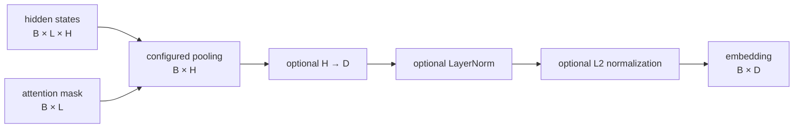
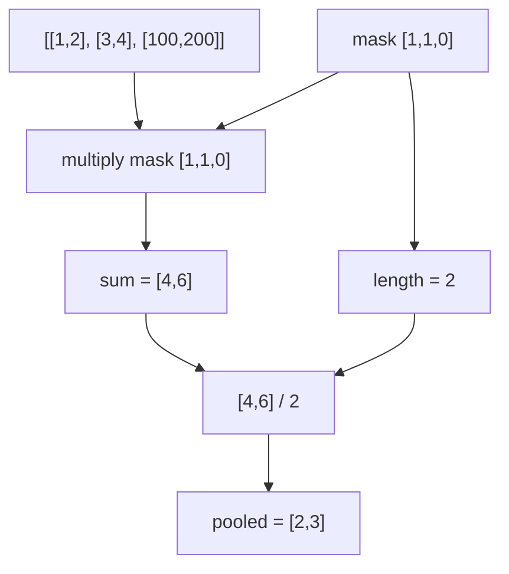
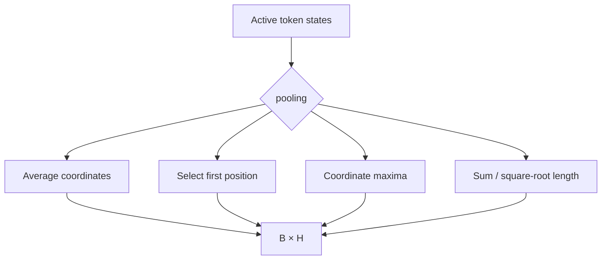
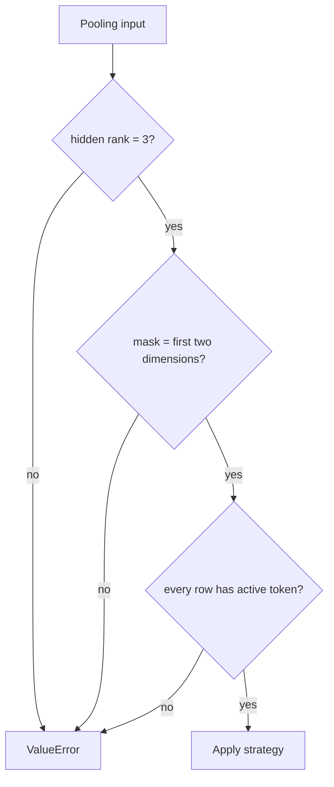
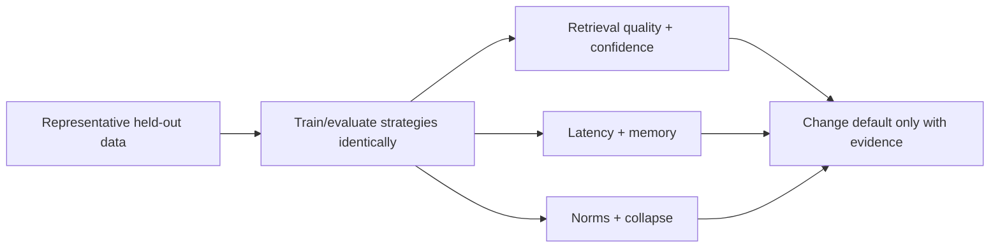

# Pooling token states into text embeddings

The Transformer emits one vector for every padded token position, shape `(B, L, H)`. Retrieval
needs exactly one vector per text, shape `(B, H)`. Pooling performs that reduction while
respecting the attention mask.

## Where pooling sits



Pooling does not change the number of hidden coordinates. Projection is the separate step
that changes `H` to the public embedding dimension `D`.

## Mask-aware mean pooling

For hidden state \(h_{b,i}\), binary mask \(m_{b,i}\), and active length
\(\ell_b=\sum_i m_{b,i}\):

```text
mean[b] = Σᵢ h[b,i] m[b,i] / ℓ[b]
```



Padding values can be nonzero after Transformer layers; multiplying by the mask at pooling is
therefore required even though padding was masked in attention.

## Four implemented strategies

| Strategy | Formula | Strength | Risk |
|---|---|---|---|
| `mean` | \(\sum hm / \ell\) | Smooth contribution from every active position | Can blur long multi-topic text |
| `cls` | \(h_{0}\) | Cheapest reduction; single designated position | Needs training that teaches CLS aggregation |
| `max` | coordinate-wise max over active positions | Preserves strong feature activations | Sparse gradients and outlier sensitivity |
| `mean_sqrt_length` | \(\sum hm / \sqrt{\ell}\) | Retains length-dependent magnitude | L2 normalization later removes that magnitude |



For max pooling, padded positions are replaced with the dtype's minimum representable value
before taking the maximum. This prevents a padded zero from winning over valid negative
activations.

## Worked comparison

Given two active states \(h_1=[1,4]\), \(h_2=[3,2]\) and one padded state:

| Strategy | Result before normalization |
|---|---|
| Mean | `[2, 3]` |
| CLS | `[1, 4]` |
| Max | `[3, 4]` |
| Mean-sqrt-length | `[4/√2, 6/√2] ≈ [2.828, 4.243]` |

If output L2 normalization is enabled, mean and mean-sqrt-length have the same direction and
therefore become the same unit vector for a given example. Without normalization their norms
differ.

## Invalid states



Rejecting fully padded rows is safer than dividing by a clamped length and returning a
plausible zero vector. Normal encoded text includes CLS and SEP, but direct model callers and
corrupt batches still need this guard.

## Why mean is the default

Masked mean pooling requires no special CLS pretraining, gives content tokens direct gradient
paths, and behaved predictably in the tiny network-free lifecycle. It is a default engineering
choice, not a universal quality claim.



When changing pooling, retrain the model, export a new artifact, rebuild the index, and compare
against the previous version. Pooling is stored in `config.json`; loading reconstructs the
matching module before strict weight loading. See [ADR 0002](adr/0002-mean-pooling.md).
