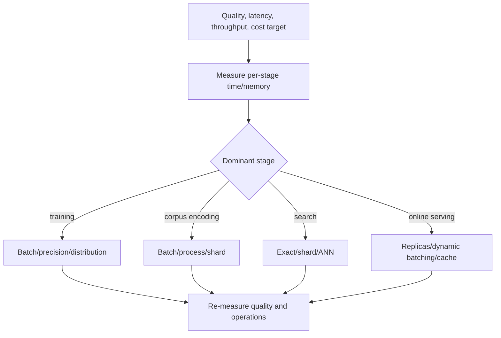
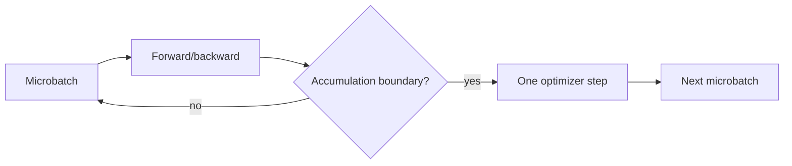
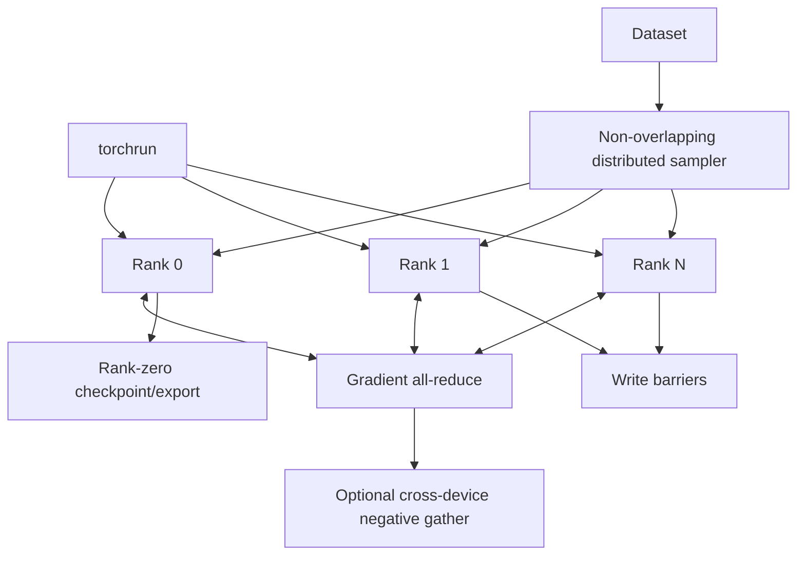
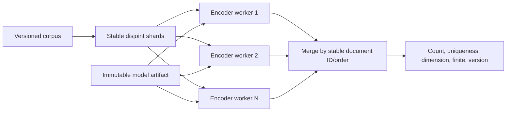
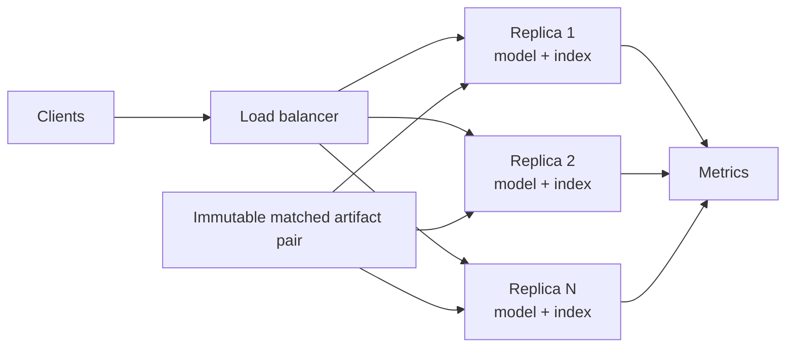

# Scaling

Scaling is four different problems: optimizing training, encoding a corpus, searching stored
vectors, and serving online requests. Measure the constrained stage before adding
parallelism—each stage has different correctness and compatibility risks.

## Find the bottleneck first



Throughput without held-out quality is not success. Every optimization that changes numeric
precision, batching, negatives, quantization, or index type needs ranking comparison.

## Training scale

| Lever | Benefit | Important caveat |
|---|---|---|
| Larger microbatch | More in-batch negatives and throughput | More activation memory and false negatives |
| Gradient accumulation | Fewer optimizer steps per loaded batch set | Does not enlarge similarity matrix |
| CUDA mixed precision | Lower memory/higher throughput on supported GPUs | Validate finite gradients and ranking |
| Shorter max length | Quadratic attention savings | Truncation can remove relevant content |
| Gradient checkpointing | Lower activation memory | More compute; not implemented |
| DDP | Multiple-device throughput | Requires correct sharding/synchronization; not implemented |



The current trainer is single-process. An executable DDP path must add:



It also needs deterministic worker seeding, no duplicated examples, sampler epoch updates,
resume tests under `torchrun`, rank-zero logging, failure propagation, and barriers around
artifact writes. `configs/train_distributed.yaml` is not proof these behaviors exist.

## Corpus encoding scale



Batch texts of similar length to reduce padding, but preserve document IDs and deterministic
output mapping. Multiple GPU workers should each own a model replica. Record artifact manifest,
corpus snapshot, shard plan, and failed/retried IDs.

## Search scale

Exact flat search stores and scans all vectors:

```text
memory ≈ N × D × 4 bytes + metadata + backend copy
query work ≈ N × D
```

```mermaid
flowchart TD
    Exact[Exact IndexFlatIP baseline] --> Meets{Fits memory and latency?}
    Meets -->|yes| Stay[Retain simpler exact design]
    Meets -->|no| Option{Constraint}
    Option -->|one host memory| Compress[PQ/quantization evaluation]
    Option -->|query latency| ANN[HNSW or IVF evaluation]
    Option -->|total corpus| Shard[Shard by stable policy]
    Compress --> Compare[Recall@K vs exact + latency/memory/build]
    ANN --> Compare
    Shard --> Merge[Distributed top-K merge]
    Merge --> Compare
```

ANN introduces build/training parameters and non-perfect recall. Sharding requires consistent
normalization, compatible model version, per-shard K, score-comparable results, deterministic
global merge, partial-failure policy, and rebalancing.

## Serving scale



One process serializes model access through the embedder lock and bounds handlers with a
semaphore. Horizontal process replication is the implemented scaling-compatible approach.

Dynamic batching is a future service:

```mermaid
sequenceDiagram
    participant R as Requests
    participant Q as Bounded queue
    participant B as Batcher
    participant M as Model

    R->>Q: enqueue with deadline
    Q->>B: compatible pending items
    B->>B: wait at most small configured window
    B->>M: combined batch
    M-->>B: ordered vectors
    B-->>R: split results; honor cancellation/deadlines
```

It needs queue-depth/wait metrics, maximum batch tokens, fairness, cancellation, overload
rejection, and deadline propagation. Simply making a route `async` does not batch kernels.

## Caching and versioning

Cache keys must include normalized request representation, tokenizer/model artifact identity,
normalization option, and authorization scope. Raw text cache keys or shared cross-tenant
caches can create privacy leakage. Disable caching unless the data classification and deletion
model are explicit.


Never update model and index independently in place.

## Capacity-planning evidence

Record hardware, software versions, corpus size, `D`, sequence-length distribution, request
batch distribution, concurrency, warmup, sample count, p50/p95/p99 latency, throughput,
CPU/GPU/RSS, index memory/build time, and retrieval quality. The included benchmark reports
local encode throughput but deliberately sets no portable performance claim.
