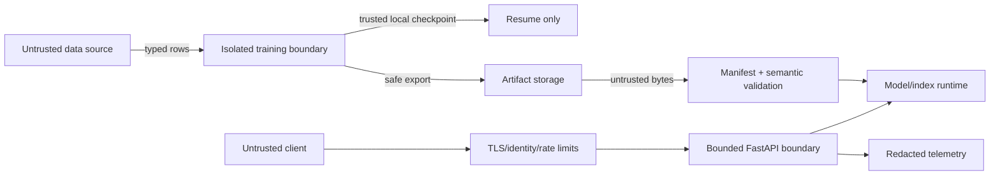
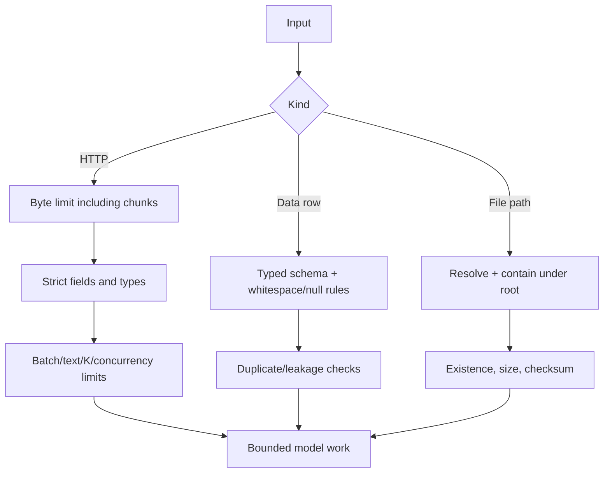
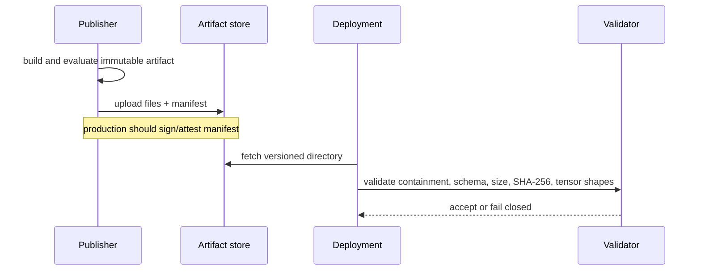
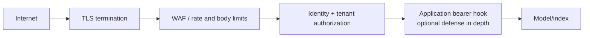
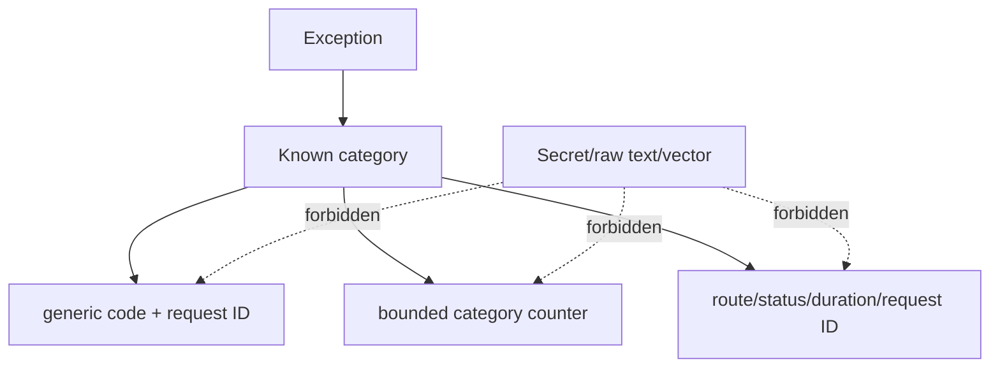
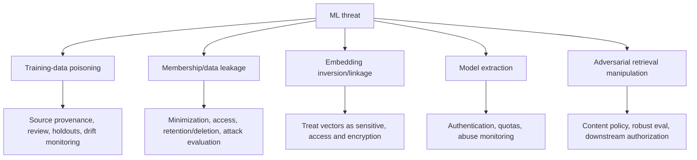
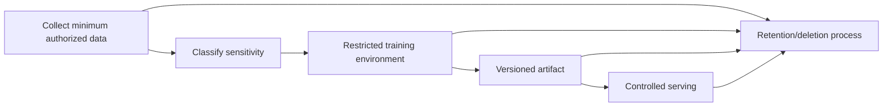

# Security and privacy

The system treats text, JSON, configuration, paths, checkpoints, artifacts, index files, and
HTTP requests as untrusted at their respective boundaries. Controls reduce risk but do not
turn embeddings or models into non-sensitive data.

## Assets and actors

| Asset | Why it matters | Typical threat |
|---|---|---|
| Training text and relevance labels | May contain confidential or personal data | Leakage, poisoning, unauthorized retention |
| Model/tokenizer | Encodes intellectual property and learned information | Tampering, substitution, extraction |
| Embeddings and index metadata | Can reveal membership/attributes/content relationships | Inversion, linkage, tenant leakage |
| Credentials/configuration | Controls service and storage access | Disclosure or privilege abuse |
| Availability resources | CPU/GPU, memory, file descriptors | Oversized or high-rate requests |
| Evaluation results | Gate releases and quality claims | Dataset leakage or metric manipulation |

Actors include ordinary clients, malicious clients, compromised data suppliers, artifact
storage attackers, over-privileged operators, and mistakes in deployment automation.

## Trust boundaries

The PyTorch resume checkpoint never crosses into the untrusted serving-load path. Published
weights use safetensors; index vectors use NumPy with pickle disabled.

## Input and resource controls

Character and batch limits bound obvious work but tokenization/model cost can still vary within
those bounds. Global rate limiting, quotas, timeouts, and admission control belong at ingress.

## Artifact and supply-chain controls

| Stage | Implemented control | Residual risk / deployment responsibility |
|---|---|---|
| Dependency install | Lockable constraints, dependency/CodeQL workflows | Verify provenance, patch policy, SBOM/signatures |
| Training resume | `weights_only=True`, schema, strict state | Trusted-local file can still be malicious/corrupt |
| Model publication | Safetensors, JSON, required files, SHA-256, path containment | Hash is integrity, not publisher authenticity |
| Index publication | `allow_pickle=False`, JSON, SHA-256, shape/ID checks | Bind index explicitly to model/corpus identity |
| Container | Non-root UID 10001, minimal runtime | Runtime policy must drop caps/read-only filesystem |

Never disable validation to recover from a checksum error. Restore a known version and
investigate storage or transport.

## HTTP security controls

The optional bearer hook uses constant-time comparison. It is intentionally small and is not
a tenant identity/authorization system.

The repository does not terminate TLS, issue tokens, authorize document-level access, scan
uploads, or enforce tenant isolation. Put those controls upstream and return only metadata the
authenticated caller is allowed to see.

## Safe errors and telemetry

Credential-like structured keys are redacted recursively. This does not sanitize arbitrary
message strings, so code must never interpolate raw text, headers, paths containing secrets,
or request bodies into log messages.

## ML-specific threats

Differential privacy, formal poisoning defenses, confidential inference, and inversion
resistance are not implemented. Do not claim those guarantees.

## Data lifecycle and privacy

Deletion may require retraining and rebuilding indexes because data influence can persist in
weights and vectors. Maintain lineage from source records to dataset, run, artifact, corpus,
and index versions so deletion obligations can be assessed.

## Deployment checklist

- Terminate TLS with modern policy and authenticate identities upstream.
- Enforce tenant/document authorization before returning index metadata.
- Set global request-rate, connection, body, and timeout limits.
- Inject secrets from a manager; never bake them into images or config files.
- Run as UID 10001 with read-only root filesystem and dropped Linux capabilities.
- Mount model/index read-only from an immutable, access-controlled source.
- Validate artifacts during promotion and startup; add signed provenance.
- Restrict `/metrics` and model metadata according to network policy.
- Encrypt sensitive data, embeddings, artifacts, logs, and backups as required.
- Test tampering, traversal, oversized/chunked bodies, auth, safe errors, and log redaction.

## Residual-risk acceptance

Before production, document dataset rights, sensitive-data classification, model/index access,
retention/deletion, abuse cases, quality failure impact, upstream controls, alert ownership, and
the accepted residual risk. Security review must cover downstream use: a safe embedding API can
still feed an authorization-bypassing retrieval application.
