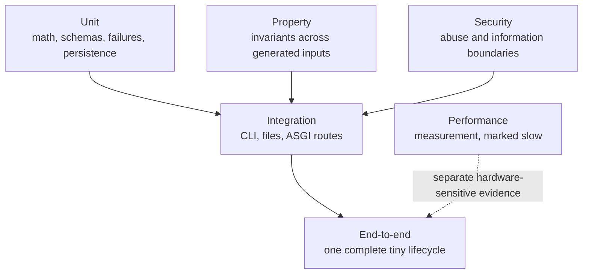
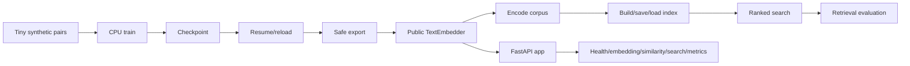
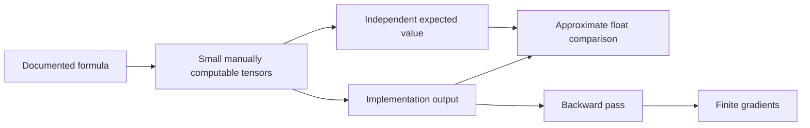
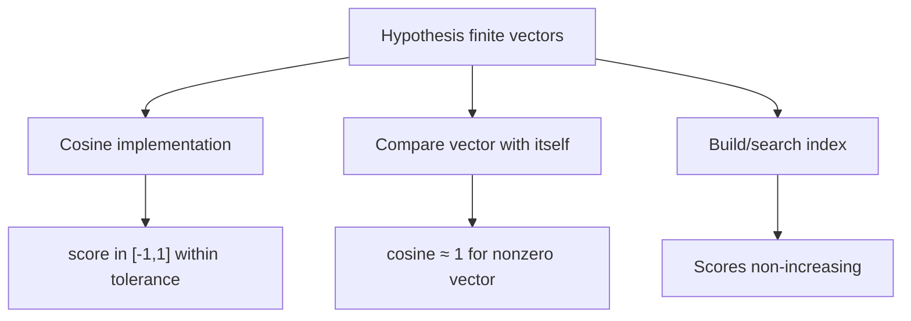
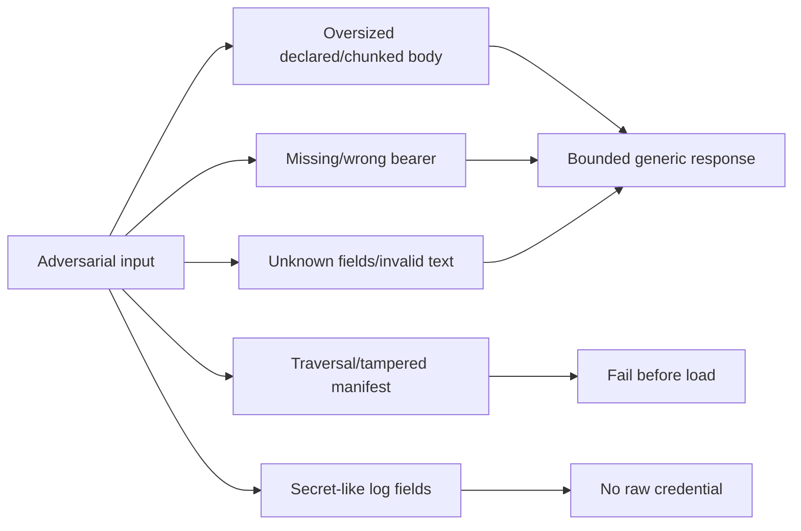
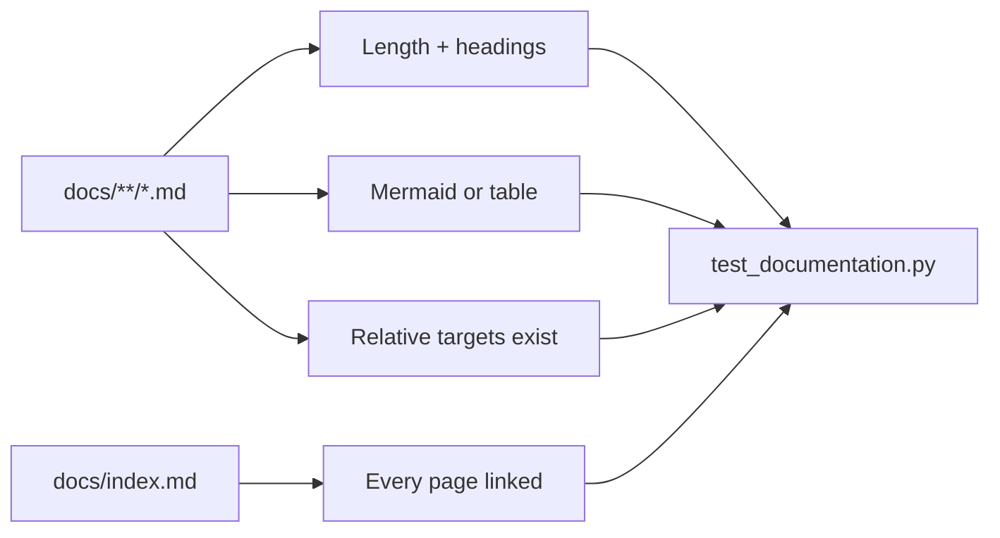
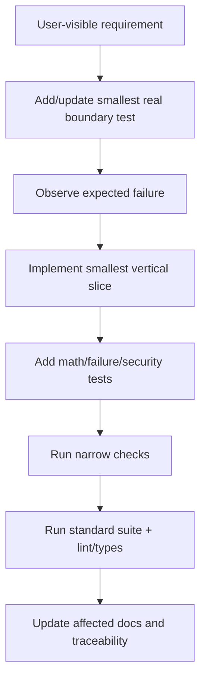

# Testing strategy

The test suite proves the real lifecycle with tiny deterministic inputs, then surrounds it with
focused mathematical, validation, property, security, integration, and performance checks.
Internal domain logic is not mocked; mocks are reserved for genuinely external boundaries.

## Test architecture



This is not a strict count-based pyramid. A small number of high-value lifecycle tests protects
cross-module behavior that isolated tests cannot.

## Canonical end-to-end path



`tests/end_to_end/test_tiny_pipeline.py` crosses each boundary with real PyTorch optimization,
safetensors, NumPy/FAISS-compatible indexing, and ASGI requests. It is network-free and CPU
compatible.

## Marker matrix

| Marker | Scope | Default expectation |
|---|---|---|
| `unit` | One mathematical/domain contract | Fast, deterministic |
| `integration` | Multiple real modules or file/API boundary | CPU/network-free |
| `end_to_end` | Full lifecycle | Tiny and deterministic |
| `security` | Abuse, tampering, privacy, safe error | Required standard path |
| `performance` | Throughput/latency measurement | Hardware-sensitive |
| `slow` | Intentionally longer work | Excluded from standard quick run |
| `gpu` | CUDA-specific behavior | Explicit compatible runner |
| `network` | Remote integration | Explicit opt-in only |

Tests may carry more than one marker when the behavior crosses concerns.

## Mathematical tests



Pooling tests include padding values that would corrupt an unmasked result. Loss tests compare
cross-entropy/cosine/triplet values and execute gradients. Retrieval tests use multiple
relevance labels with manually computed outcomes. Correlation tests cover average ranks for
ties and undefined constant inputs.

## Contract and failure tests

| Boundary | Success contract | Representative failures |
|---|---|---|
| Config | Typed valid object | Unknown keys, incompatible shapes/device/precision |
| Data | No silent dropping | Nulls, blanks, duplicate IDs, malformed rows |
| Tokenizer | Stable IDs/merges | Corrupt JSON, special IDs, tiny vocabulary |
| Model/loss | Finite expected shapes | Rank mismatch, fully padded rows, invalid target domains |
| Checkpoint/artifact | Exact reload | Missing/corrupt/schema/shape mismatch |
| Index | Stable exact ranking | Empty, duplicate ID, dimension, zero/non-finite, traversal |
| API | Typed safe response | Oversize, auth, unknown field, blank/long text, safe 4xx/5xx |

Failure tests assert behavior and safe information boundaries, not incidental full exception
formatting.

## Property tests



Properties explore more inputs than fixed examples while examples retain clear arithmetic
evidence. Strategies must avoid invalid values unless the test is specifically validating
rejection.

## Security tests



Security behavior is part of the public contract. Tests verify request IDs, status/error code,
absence of input/stack traces, path containment, checksum rejection, auth hooks, and redaction.

## Documentation tests

Every Markdown page is required to be discoverable from `docs/index.md`, substantial enough to
have navigable sections, include a diagram or comparison table, balance Mermaid fences, and
resolve relative links.



This structural gate cannot determine whether prose is correct; source review and command
verification remain required.

## Determinism controls

- tiny local tokenizer and random Transformer, with no downloads;
- fixed Python/NumPy/PyTorch seeds;
- CPU baseline and small shapes;
- deterministic tie rules for vocabulary, merges, splits, and search;
- temporary directories for artifacts;
- approximate comparisons with justified tolerances;
- no dependence on wall-clock performance in portable functional tests.

Determinism should not be achieved by mocking away the behavior under test.

## Verification order

```bash
pytest tests/unit/test_documentation.py -q
pytest tests/unit/test_modeling_losses.py -q
pytest -m unit -q
pytest -m "not slow and not network and not gpu" -q
pytest -m integration -q
pytest -m end_to_end -q
pytest -m security -q
pytest --cov=embedding_model --cov-branch --cov-report=term-missing
ruff format --check .
ruff check .
mypy src
```

Run the narrowest reproducer first, then expand. Performance tests must report hardware,
software, warmup, sample count, and configurable thresholds; they should not fail portable CI
on an arbitrary latency number.

## Adding behavior



Avoid tests that merely duplicate implementation branches. Prefer observable contracts:
outputs, saved artifacts, reload behavior, safe failures, and stable public APIs.
