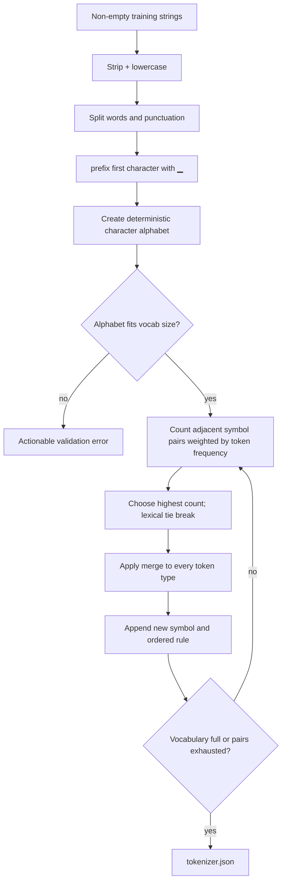
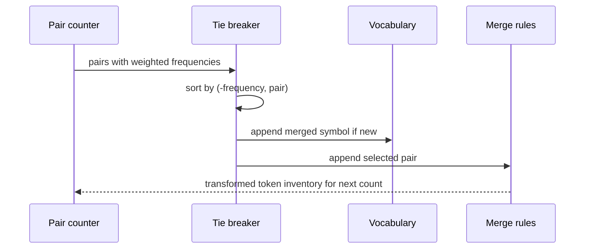
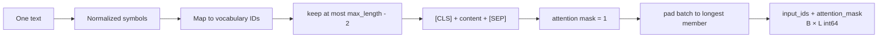
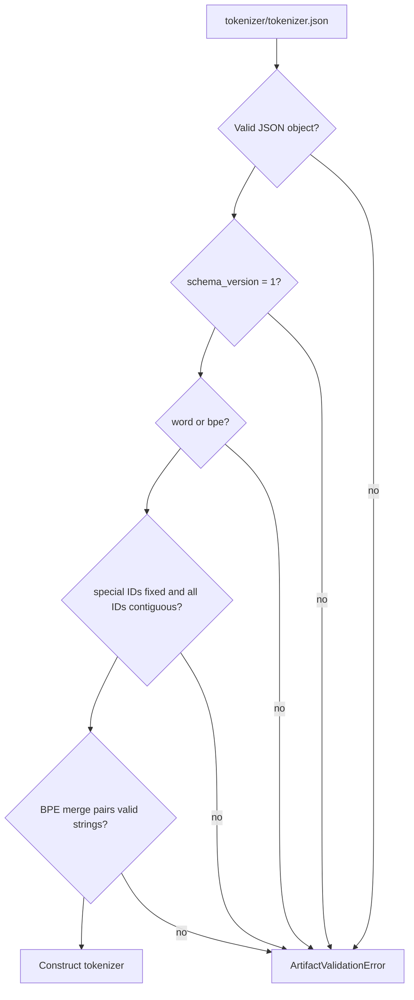
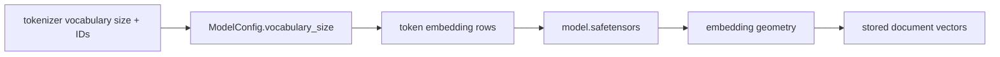

# Tokenization

Tokenization converts text into stable integer IDs before the Transformer sees it. A tokenizer
is therefore part of the model definition: changing normalization, vocabulary IDs, merge
order, or special-token IDs changes every downstream tensor and invalidates compatible
weights and indexes.

## Implemented tokenizers

| Feature | `BPETokenizer` | `LocalTokenizer` |
|---|---|---|
| Intended use | CLI training and normal local workflow | Small unit fixtures |
| Base symbols | Unicode characters with word-boundary prefix | Lowercased regex word/punctuation tokens |
| Learned operation | Ordered frequent-pair merges | Frequency-ranked whole-token vocabulary |
| Unknown behavior | Unknown characters may become `[UNK]` | Unknown whole tokens become `[UNK]` |
| Serialization | Vocabulary plus ordered merges | Vocabulary |
| Determinism | Frequency then lexical tie break | Frequency then lexical tie break |

Both use `\w+|[^\w\s]`, lowercase after stripping outer whitespace, and reserve fixed IDs:

| ID | Token | Role |
|---:|---|---|
| 0 | `[PAD]` | Batch padding; ignored by attention and pooling |
| 1 | `[UNK]` | Symbol/token absent from the trained vocabulary |
| 2 | `[CLS]` | First active position and CLS pooling source |
| 3 | `[SEP]` | Last active position after truncation |

## BPE training algorithm



The boundary marker distinguishes word starts. For the token `cat`, initial symbols are
`("▁c", "a", "t")`. If the learned rules are `("▁c","a")` then `("▁ca","t")`, inference
replays them in that exact order and emits `["▁cat"]`.

## Deterministic tie handling

Suppose adjacent pairs `("a","b")` and `("a","c")` each occur five times. The trainer chooses
the lexically smaller pair. This rule matters because choosing one merge changes the pairs
available on the next iteration.



The resulting merge list is model data, not a cache. Re-sorting it during save/load would
change tokenization.

## Encoding a batch



Padding is dynamic within each batch, not forced to the configured maximum. This reduces
attention work while preserving the same maximum contract.

Example for two encoded rows:

```text
input_ids      [[2, 17, 31, 3],
                [2,  8,  3, 0]]
attention_mask [[1,  1,  1, 1],
                [1,  1,  1, 0]]
```

The input sequence is truncated before SEP so the final active marker is retained. Empty or
whitespace-only strings, non-string values, empty batches, and `max_length < 2` fail.

## Serialization and load validation



The outer artifact manifest verifies tokenizer bytes before this semantic validation. Both
layers are needed: a correctly checksummed but structurally invalid file must still fail.

## Compatibility chain



Compatibility checks currently prove vocabulary size and artifact integrity. Operationally,
promote tokenizer, model, and index as one immutable version; never edit `tokenizer.json` in
place even if the vocabulary size remains unchanged.

## Training and production guidance

Fit the tokenizer only on licensed, representative training text. Record corpus version,
normalization policy, requested/actual vocabulary size, special IDs, and length/unknown
distributions. Avoid fitting on held-out evaluation text if vocabulary leakage would bias the
comparison. The CLI command is:

```bash
embedding-project train-tokenizer \
  --data data/sample_pairs.jsonl \
  --output-dir artifacts/tokenizer \
  --vocab-size 128
```

The current implementation is character BPE over Unicode code points, not byte-level BPE.
Previously unseen scripts may therefore use `[UNK]`; measure that behavior before multilingual
deployment.
