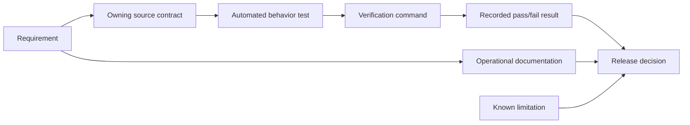
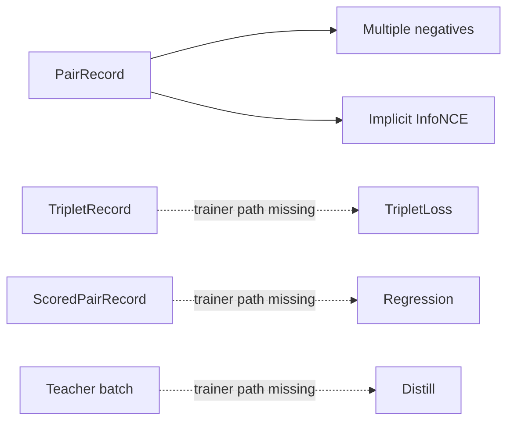
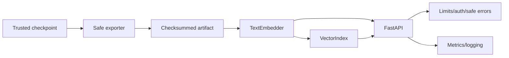
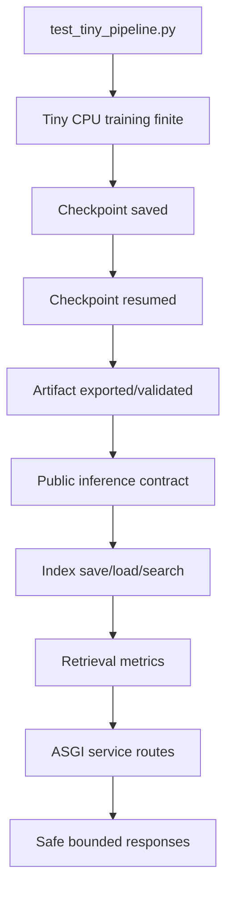

# Requirement traceability

Traceability connects user-visible requirements to implementation ownership, automated
evidence, operational proof, and known limits. It is a navigation aid, not a claim that a file
name alone proves behavior.

## Evidence model

An acceptance claim should identify all of these links. Manual review is still required for
semantic quality, security architecture, documentation accuracy, and hardware-dependent
performance.

## Core model and data

| Requirement | Source | Automated evidence | Primary command |
|---|---|---|---|
| Strict typed configuration | `config.py` | `test_config_data_tokenizer.py`, failure tests | `pytest -m unit -q` |
| Pair/triplet/scored/retrieval records | `data/schemas.py` | schema and branch tests | `pytest -m unit -q` |
| JSONL/CSV/Parquet readers, no silent drops | `data/readers.py` | reader success/failure tests | `pytest -m unit -q` |
| Reproducible split/statistics | `data/preprocessing.py` | split/statistics tests | `pytest -m unit -q` |
| BPE/word tokenizers and persistence | `tokenization.py` | tokenizer round-trip/failure tests | `pytest -m unit -q` |
| Transformer output contract | `modeling/embedding_model.py` | modeling and E2E tests | `pytest -m end_to_end -q` |
| Four mask-aware pooling modes | `modeling/pooling.py` | hand-computed parametrized tests | `pytest tests/unit/test_modeling_losses.py -q` |
| Similarity functions | `modeling/similarity.py` | hand-computed/property tests | `pytest -m unit -q` |

## Learning and training

| Requirement | Source | Automated evidence | Current scope |
|---|---|---|---|
| Multiple-negatives ranking | `losses/contrastive.py` | value + finite-gradient tests | Wired to pair trainer |
| InfoNCE | `losses/contrastive.py` | explicit/implicit tests | Implicit path wired |
| Triplet | `losses/triplet.py` | hand-computed gradient test | Loss only; no trainer method |
| Cosine regression | `losses/cosine_regression.py` | target/value test | Loss only; no trainer method |
| Distillation | `losses/distillation.py` | component/gradient test | Loss only; no trainer method |
| AdamW, accumulation, clipping, schedule | `training/trainer.py` | unit branches + E2E | Single process |
| Validation/early stopping/best checkpoint | `training/trainer.py` | trainer failure/branch tests | Pair objective |
| Resume and interruption state | `training/checkpointing.py` | E2E and failure tests | Trusted local files |
| CPU fallback/CUDA AMP validation | `config.py`, `trainer.py` | config tests | GPU path not standard CI |

## Evaluation and retrieval

| Requirement | Source | Tests | Operational path |
|---|---|---|---|
| Pearson/Spearman/MSE | `evaluation/similarity.py` | hand-computed ties/failures | `embedding-project evaluate` |
| Recall/Precision/MRR/MAP/NDCG/Hit Rate | `evaluation/retrieval.py` | multi-relevance example | Python API and E2E |
| Silhouette/ARI/NMI | `evaluation/clustering.py` | clustering contract tests | Python API |
| Norm/variance/collapse/duplicate diagnostics | `evaluation/diagnostics.py` | collapse/duplicate tests | CLI evaluation |
| Random and TF-IDF baselines | `evaluation/baselines.py` | baseline contract tests | Python API |
| Random/lexical/embedding/semi-hard miners | `data/samplers.py` | deterministic exclusion tests | Lexical CLI path |
| Exact normalized search | `indexing/faiss_index.py` | unit/property/E2E tests | `make build-index-tiny` |
| Safe index persistence | `indexing/faiss_index.py` | tamper/path/shape tests | Index load before serve |

## Artifacts, inference, and serving

| Requirement | Source | Tests | Verification |
|---|---|---|---|
| Safetensors export and strict load | `export/exporter.py` | artifact unit/E2E | `validate-artifacts` |
| Manifest schema/checksum/path containment | `export/manifest.py` | tamper/traversal tests | `pytest -m security -q` |
| Stable string/sequence/empty encoding | `inference/embedder.py` | inference contract tests | `make smoke` |
| Float32/finite/order/unit normalization | model + embedder | unit/property/E2E | standard test suite |
| Health/version/model metadata | `serving/app.py` | route integration tests | ASGI integration |
| Embeddings/similarity/search routes | `serving/app.py` | integration/E2E | `pytest -m integration -q` |
| Byte/batch/text/K/concurrency limits | app/settings | security tests | `pytest -m security -q` |
| Bearer hook/CORS/safe errors | app/settings | security tests | `pytest -m security -q` |
| Request IDs/redacted JSON logs | app/logging | logging/security tests | unit/security suite |
| Prometheus metrics | `serving/metrics.py` | API integration | `/metrics` route |

## Packaging and operations

| Requirement | Source | Evidence command | Limit |
|---|---|---|---|
| Python 3.11+ src package | `pyproject.toml` | `python -m build` | Host needs compatible Python |
| Unified CLI | `cli.py` | `embedding-project --help` | Some public Python APIs lack CLI paths |
| Non-root runtime image | `docker/Dockerfile` | `make docker-build`, container `id` | Deployment policy remains external |
| Read-only/drop-cap compose guidance | `docker-compose.yml` | configuration review/startup smoke | Needs mounted model/index |
| CI lint/type/test/package | `.github/workflows/ci.yml` | local equivalent commands | Hosted runner variance |
| Dependency and code scanning | security workflow | GitHub workflow result | Requires triage/patch process |
| Documentation discoverability/links/visuals | `docs/`, docs test | `pytest tests/unit/test_documentation.py -q` | Structural, not semantic proof |

## End-to-end acceptance path

This path proves lifecycle integration with tiny synthetic data. It does not prove production
semantic quality, GPU behavior, distributed execution, large-corpus performance, or external
identity/TLS systems.

## Known gaps and ownership

| Gap | Evidence needed to close it | Likely ownership |
|---|---|---|
| Pretrained/MLM quality path | Licensed pinned model/data, adapter, E2E and quality report | Modeling/training |
| Triplet/regression/distillation trainer paths | Typed collators, trainer/CLI, resume/E2E tests | Training |
| DDP | `torchrun` implementation and multi-process resume tests | Training/platform |
| ANN/sharded search | Exact-recall benchmark, safe artifact format, failure policy | Retrieval/platform |
| Dynamic batching | Queue/deadline implementation and load tests | Serving/platform |
| Signed provenance | Signature policy, keys, verification/promotion tests | Security/platform |
| Tenant authorization/TLS/rate limits | Deployment integration tests and runbooks | Platform/security |
| Production quality benchmark | Representative locked dataset, baselines, uncertainty | ML/product |

When behavior changes, update the source test, nearest end-to-end path, this matrix, affected
guide, and ADR if the architectural decision changed.
