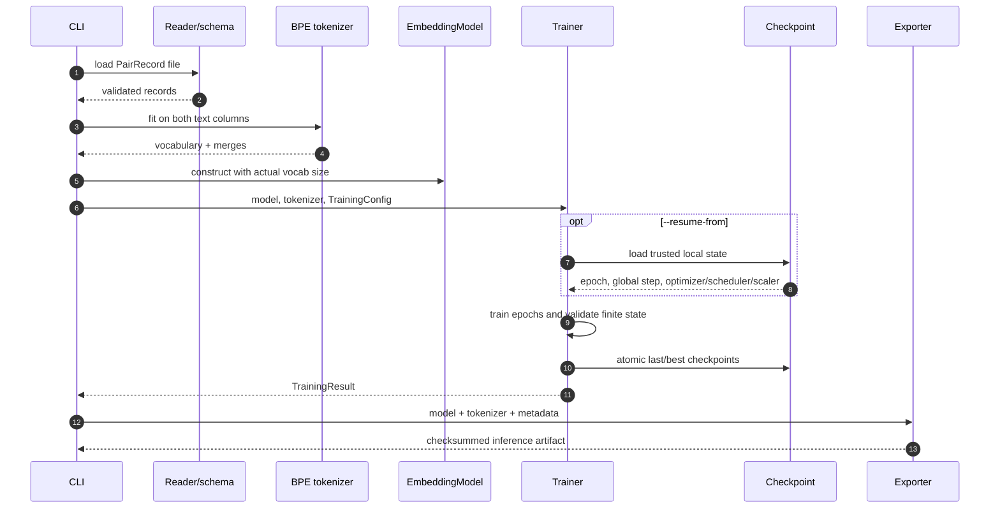
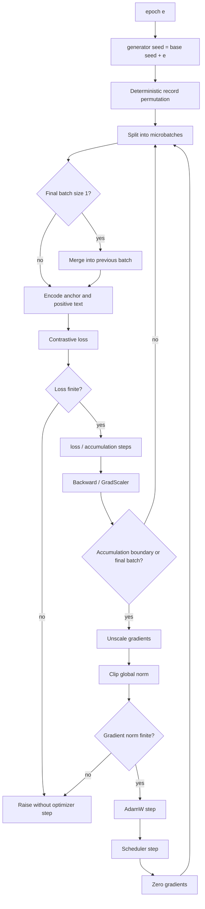
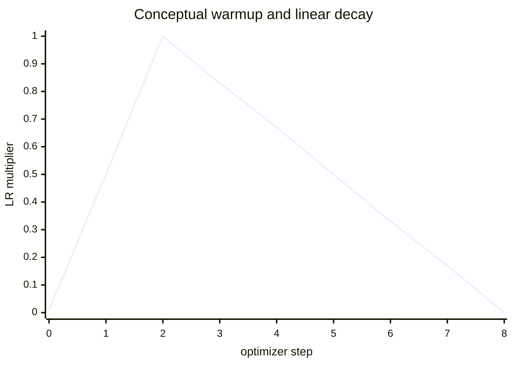
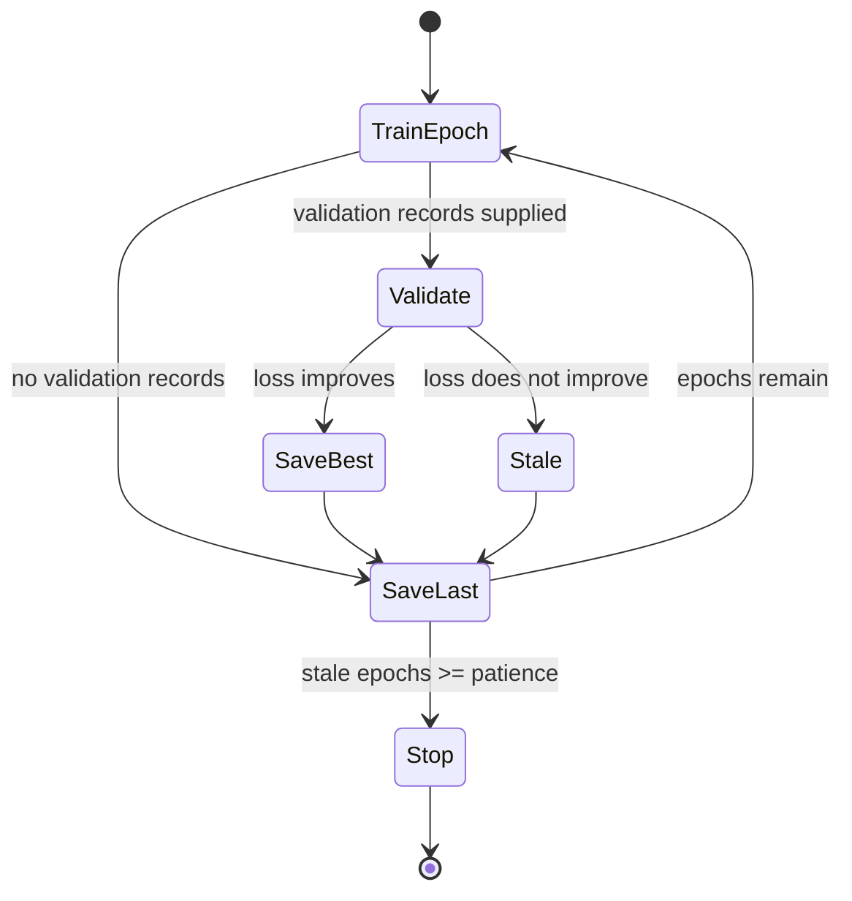
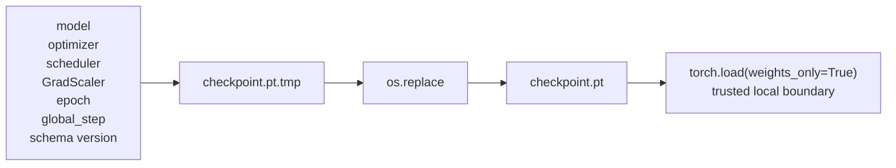
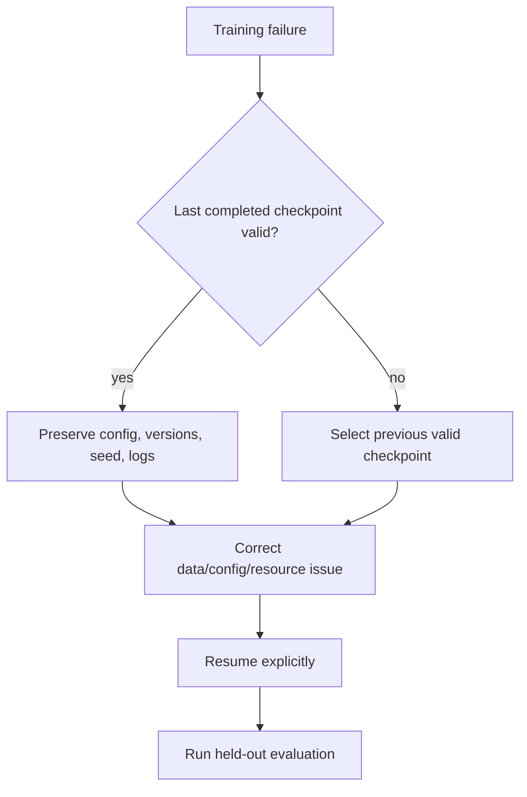

# Training and reproducibility

The trainer turns validated `PairRecord` examples into optimizer updates, resumable trusted
checkpoints, and finally a safe inference artifact. The current vertical CLI path supports
multiple-negatives ranking and implicit InfoNCE on one process, with CPU fallback and optional
single-device CUDA mixed precision.

## End-to-end training sequence



## Configuration contract

| Setting | Meaning | Validation/interaction |
|---|---|---|
| `objective` | Training loss | Pair trainer accepts only MNR or InfoNCE |
| `epochs` | Maximum passes over records | At least 1; resume starts from saved epoch |
| `batch_size` | Pair records per microbatch | At least 2 |
| `gradient_accumulation_steps` | Microbatches per optimizer step | At least 1 |
| `learning_rate`, `weight_decay` | AdamW settings | Non-negative domains |
| `warmup_ratio` | Fraction of optimizer steps warming up | `[0, 1)` |
| `max_gradient_norm` | Clip threshold | Positive |
| `temperature` | Contrastive logit scale | Positive |
| `mixed_precision` | CUDA float16 autocast/scaler | Rejected without CUDA |
| `device` | `auto`, `cpu`, or `cuda` | Explicit unavailable CUDA is rejected |
| `seed`, `deterministic` | Randomness policy | Python, NumPy, PyTorch, CUDA seeded |
| `early_stopping_patience` | Stale validation epochs | Optional positive integer |

Unknown YAML keys fail because configuration models use `extra="forbid"`. Model configuration
also validates head divisibility, padding ID, sequence bounds, and projection dimensions.

## One epoch in detail



The reported epoch loss is the mean of unscaled microbatch losses. Accumulation changes update
frequency, not the number of in-batch negatives visible to each loss call.

## Learning-rate schedule

The trainer computes total optimizer steps from batches, accumulation, and configured epochs.
The multiplier warms linearly from near zero and then decays linearly:



The exact warmup step count is `int(total_steps * warmup_ratio)`. Scheduler state is included
in checkpoints so resume continues the saved schedule rather than restarting it.

## Validation, best checkpoint, and early stopping



Validation uses evaluation mode and no gradients. Singleton validation fragments are skipped;
the full validation input must still yield at least one batch of two because the objective
requires an in-batch negative. `best.pt` is written on improvement and `last.pt` after each
completed epoch.

## Checkpoint state and trust



Atomic replacement avoids exposing a partially written final filename. `weights_only=True`
narrows PyTorch loading, but resume files still contain framework-specific optimizer state and
are not the published untrusted artifact format. Only load checkpoints produced inside the
trusted training environment.

Resume reconstructs the same model, tokenizer, optimizer, scheduler, and scaler first, then
loads state strictly. Changing architecture or tokenizer between checkpoint creation and
resume fails rather than partially applying tensors.

## Interruption and failure behavior

| Failure | Trainer behavior | Operator response |
|---|---|---|
| `KeyboardInterrupt` | Writes `interrupted.pt`, logs bounded run/step fields, re-raises | Resume explicitly after inspecting state |
| CUDA/CPU out of memory text from PyTorch | Raises actionable batch/length guidance | Reduce batch/length; consider accumulation |
| Non-finite loss | Stops before backward/update | Reproduce on CPU; inspect data/LR/objective |
| Non-finite gradient norm | Stops before optimizer step | Lower LR, inspect activations/mixed precision |
| Incompatible objective/data | Fails before training | Use supported pair objective or build typed path |
| Invalid checkpoint | Raises artifact validation error | Use earlier trusted checkpoint; never ignore corruption |



## Reproducibility envelope

The trainer seeds Python, NumPy, PyTorch, and all CUDA devices. Epoch shuffling uses
`seed + epoch`, and deterministic algorithms are requested with warnings. Reproduction still
depends on CPU/GPU model, driver, PyTorch/NumPy versions, kernel selection, worker scheduling,
and input bytes.

Record at least:

- resolved model/training configuration and Git commit;
- tokenizer and dataset versions/checksums;
- Python/package/driver versions and hardware;
- run ID, seed, batch/accumulation schedule, and objective;
- checkpoint schema/step and exported artifact manifest;
- held-out evaluation dataset/version and report.

## Commands and outputs

```bash
make train-tiny

embedding-project train \
  --config configs/train_cpu.yaml \
  --data data/sample_pairs.jsonl \
  --output-dir artifacts/domain-model

embedding-project train \
  --config configs/train_cpu.yaml \
  --data data/sample_pairs.jsonl \
  --output-dir artifacts/resumed-model \
  --resume-from artifacts/checkpoints/last.pt
```

Export refuses to overwrite a non-empty artifact directory. Training emits JSON with artifact
path, global step, and training loss; epoch logs include run ID, epoch, step, train/validation
loss, and current learning rate without raw training text.

## Current limits

The code is single-process. It does not implement DDP, cross-device negative gathering,
gradient checkpointing, MLM pretraining, or trainer methods for triplet/regression/distillation
records. `configs/train_distributed.yaml` is sizing documentation, not executable DDP proof.
See [scaling](scaling.md) for the required state transitions and
[testing strategy](testing_strategy.md) for the verified tiny lifecycle.
