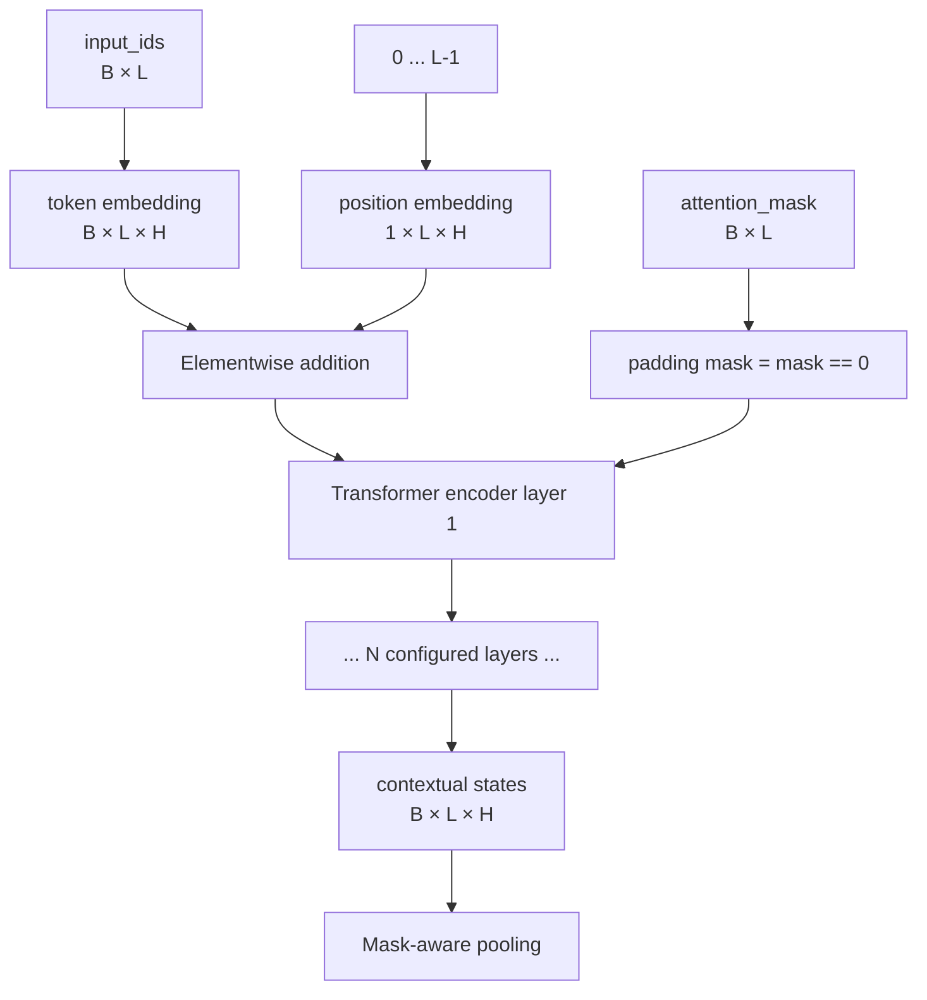
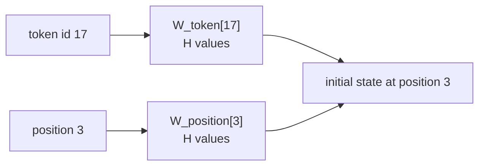
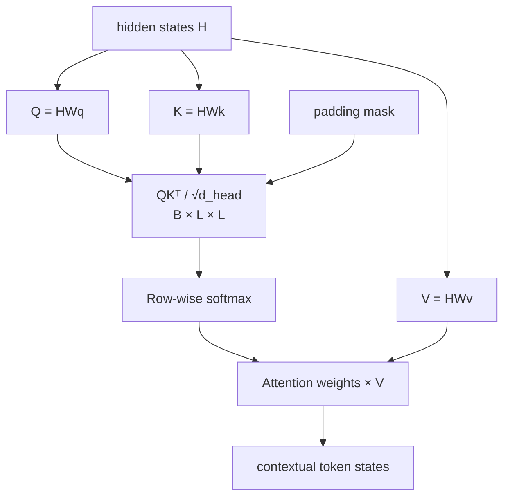
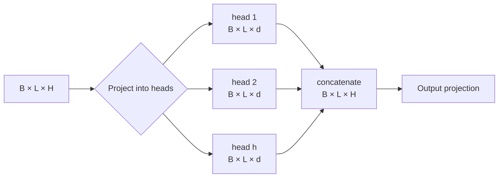
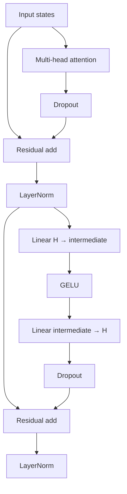
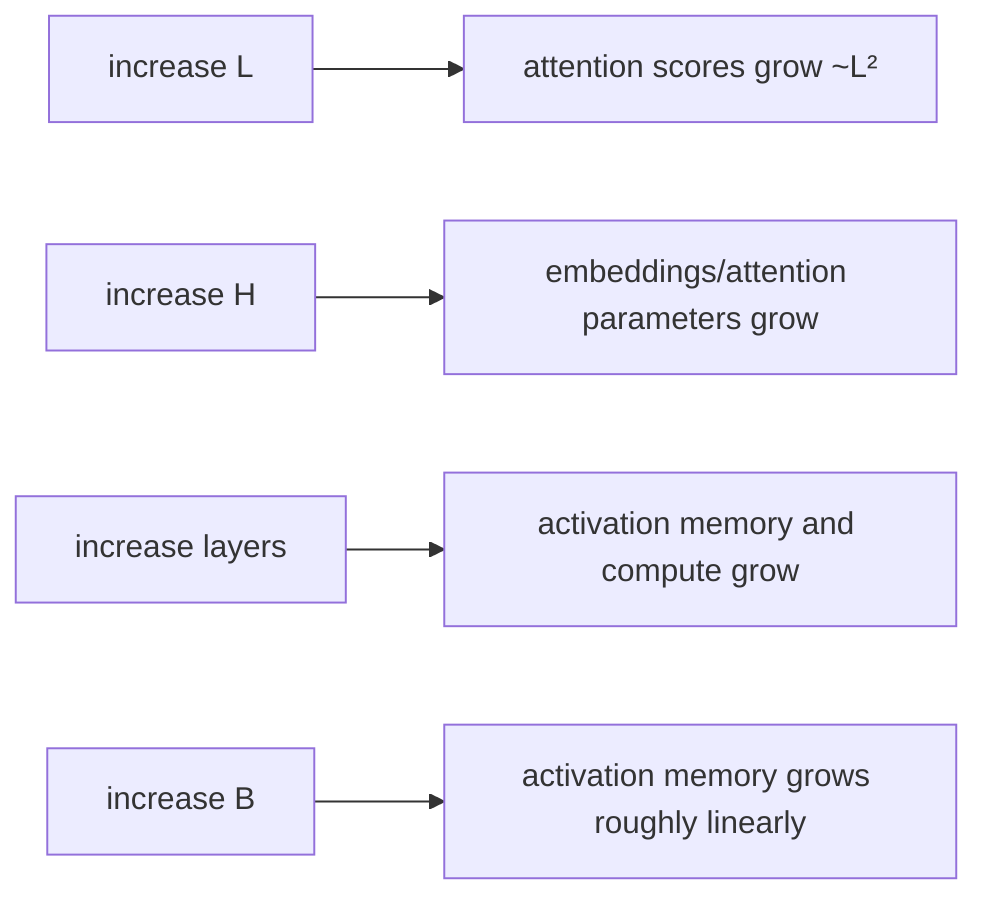

# Transformer fundamentals

The local encoder is a PyTorch `nn.TransformerEncoder`: token and learned positional
embeddings enter one or more encoder layers, each layer applies multi-head self-attention and
a position-wise feed-forward network, and a mask prevents padding from participating.

## Implemented encoder stack



`ModelConfig` validates that `hidden_size` is divisible by `num_attention_heads`, sequence
length is bounded, padding ID is inside the vocabulary, and public dimension equals hidden
width when projection is disabled.

## Token and position embeddings

An integer token ID selects a row from a learned matrix
\(W_{token}\in\mathbb{R}^{V\times H}\). Position \(i\) selects a row from
\(W_{position}\in\mathbb{R}^{L_{max}\times H}\):

```text
h⁰[b, i] = W_token[input_ids[b, i]] + W_position[i]
```



Token embeddings say what symbol is present; position embeddings distinguish order. Learned
positions make the maximum sequence length an architectural parameter stored in the artifact.

## Scaled dot-product self-attention

For each head, learned projections transform hidden states into queries, keys, and values:

```text
Q = HW_Q              shape B × L × d_head
K = HW_K              shape B × L × d_head
V = HW_V              shape B × L × d_head
A = softmax(QKᵀ / sqrt(d_head) + padding_mask)
head_output = AV       shape B × L × d_head
```



Scaling by \(\sqrt{d_{head}}\) keeps dot products from growing with width and saturating the
softmax. The key-padding mask marks padded key positions so active tokens cannot attend to
them. Pooling separately applies the original attention mask, ensuring padded outputs do not
affect the text vector.

## Multi-head attention



Heads have separate parameters and may learn different interaction patterns, but head
interpretations are empirical rather than guaranteed. The divisibility validation ensures
each head receives an integer width.

## One encoder layer



Residual paths make identity-like signal propagation possible. LayerNorm controls activation
statistics. The feed-forward block transforms each token position independently after
attention has mixed information between positions. Dropout is active in `train()` and
disabled in `eval()`; `TextEmbedder` forces evaluation mode for stable inference.

## Mask and shape invariants

| Invariant | Enforcement | Failure prevented |
|---|---|---|
| IDs and mask are rank 2 with equal shape | Model forward validation | Misaligned padding or accidental broadcasting |
| `L <= max_sequence_length` | Tokenizer truncation and model validation | Position table overrun |
| Padding mask derives from zeros | Encoder call | Padding influencing attention |
| At least one active token | Pooling validation | Undefined pooled vector |
| Output is finite | Model forward validation | NaN/Inf entering loss or index |

Special CLS and SEP tokens mean normal encoded strings contain at least two active positions.
The fully padded check still protects direct tensor callers and corrupted pipelines.

## Compute and memory

Self-attention creates an \(L\times L\) score matrix per head, so its dominant sequence cost
is \(O(BL^2H)\); feed-forward work is roughly \(O(BLH\,I)\), where \(I\) is intermediate
width.



Reduce maximum length before reducing model correctness controls. Gradient accumulation
reduces optimizer-step frequency but does not remove per-microbatch activation cost or create
additional simultaneous in-batch negatives.

## Initialization and quality boundary

The standard workflow initializes all Transformer weights randomly. Contrastive pair training
can teach a tiny corpus-specific mapping, but it does not recreate broad linguistic knowledge.
A production quality path generally needs licensed representative pretraining or a compatible
pretrained encoder, followed by domain fine-tuning and held-out evaluation. That adapter is an
extension seam described in [architecture](architecture.md#extension-seams), not an existing
feature.
