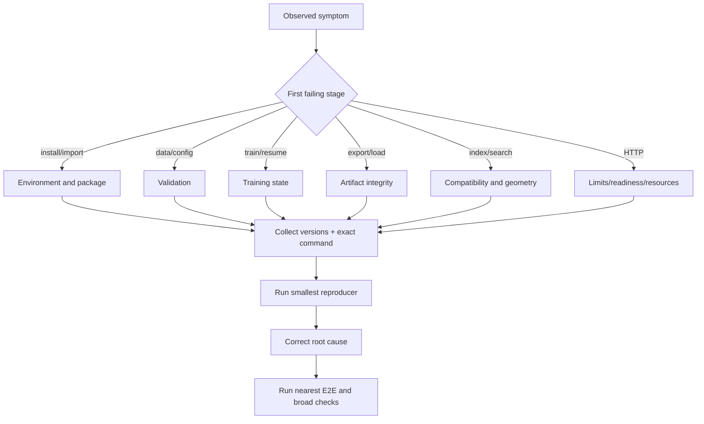
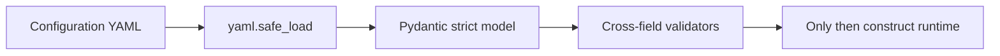
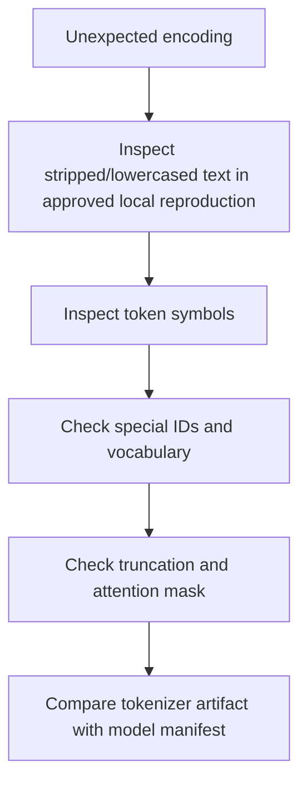
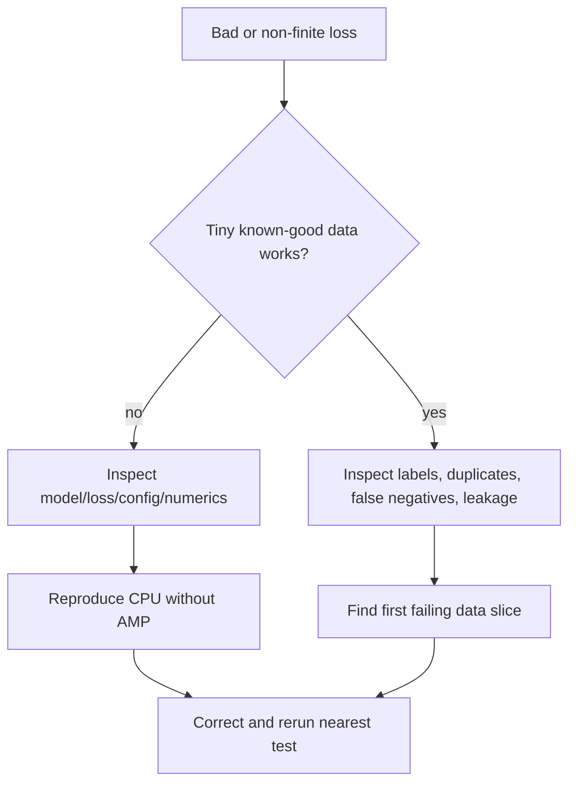
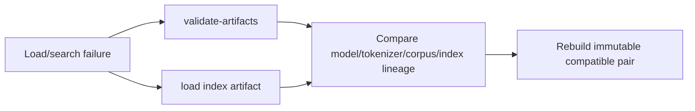
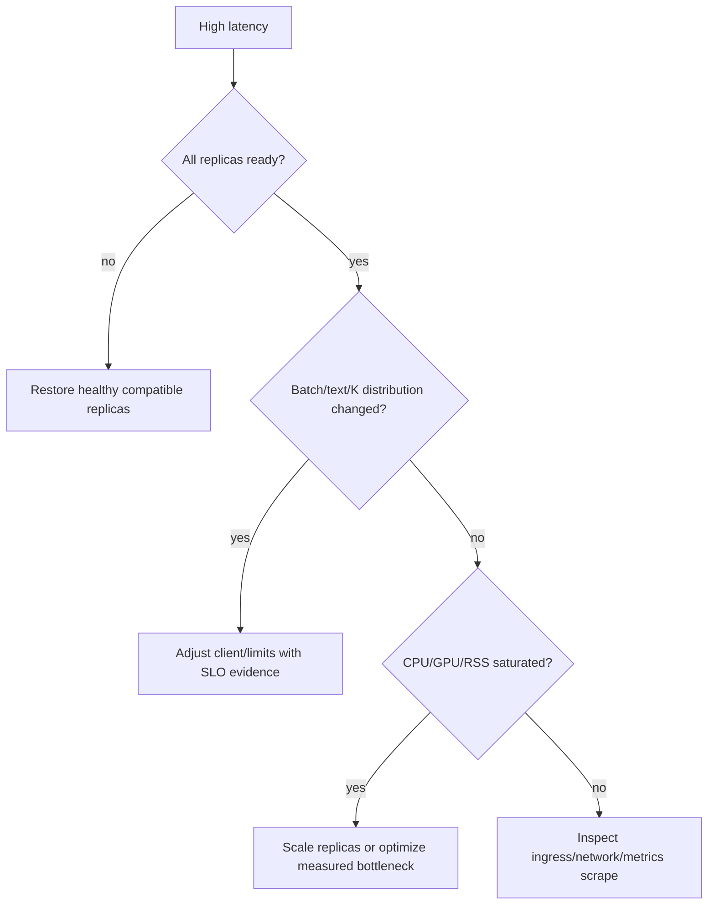

# Troubleshooting

Diagnose from the first boundary where actual behavior diverges from the contract. Preserve
evidence before retrying, and do not weaken validation, run containers as root, or log raw text
to make an incident easier to inspect.

## First-response decision tree

## Preserve this evidence

Record the exact command, exit code, timestamp/timezone, Git commit/status, Python and package
versions, hardware/driver, resolved configuration with secrets redacted, dataset/artifact/index
version or digest, request ID, and bounded relevant logs/metrics. Do not copy production text or
credentials into tickets.

## Installation and configuration

| Symptom | Diagnostic | Resolution |
|---|---|---|
| Python/package install fails | Check `python --version` and resolver output | Use Python 3.11+ and supported dependency constraints |
| Unknown config key | Read full Pydantic field path | Correct spelling; do not ignore extras |
| CUDA requested but unavailable | Check PyTorch CUDA availability/driver | Select CPU/auto or install compatible CUDA stack |
| Mixed precision rejected | Device resolves to CPU | Disable it or use supported CUDA |
| Model head-width error | `hidden_size % heads != 0` | Choose divisible architecture |
| Projection error | Projection off but `H != D` | Enable projection or make dimensions equal |

## Data and tokenizer

| Symptom | Likely cause | Resolution |
|---|---|---|
| Reader reports a line/row | Blank/malformed/null/wrong schema | Fix source row; no silent dropping |
| Duplicate-ID error | Non-canonical source IDs | Deduplicate by a documented identity rule |
| BPE vocabulary too small | Character alphabet exceeds requested size | Increase vocabulary or correct unexpected script/noise |
| Too many `[UNK]` symbols | Unseen character/script distribution | Refit on representative authorized corpus and retrain |
| Sequence information missing | Heavy truncation | Inspect token-length percentiles; adjust max length/data chunking |
| Tokenizer/model mismatch | Token IDs or vocab changed | Load artifact tokenizer; rebuild model/index pair |

## Training

| Symptom | Evidence to inspect | Corrective action |
|---|---|---|
| Loss does not fall | Tiny overfit, positives, LR, gradient norms | Fix labels/negative difficulty; tune with held-out data |
| NaN/Inf loss | First failing step, CPU reproduction, LR/AMP | Lower LR, disable AMP, inspect tensors/data |
| CUDA OOM | Allocated memory, batch/length | Reduce microbatch/length; accumulate; measure again |
| Embeddings collapse | Variance, mean cosine, norms | Review objective/data; lower LR; improve negatives |
| Validation worsens | Train/validation curves and leakage | Early-stop; inspect domain shift/overfit |
| Resume fails | Checkpoint schema/config/tokenizer | Use exact compatible trusted state or earlier checkpoint |
| Nondeterministic result | Versions/hardware/kernel/seed | Reproduce CPU, fixed environment, explicit tolerance |

## Artifacts and indexes

| Symptom | Meaning | Safe response |
|---|---|---|
| Missing/size/checksum mismatch | Artifact bytes differ from manifest | Reject; restore known immutable version |
| Path escapes root | Malicious/corrupt manifest entry | Reject and investigate publisher/storage |
| Tensor name/shape mismatch | Config and weights incompatible | Re-export matching model; never partial-load |
| Duplicate/zero/non-finite index vector | Invalid corpus/model output | Fix source or model before rebuilding |
| Model/index dimension mismatch | Obvious incompatible versions | Deploy matched pair |
| Wrong results despite same dimension | Semantic version mismatch or weak model | Compare manifest lineage and held-out evaluation |
| Equal-score order changes | Different insertion order/version | Preserve stable build ordering and artifact |

## Serving

| Symptom | Check | Resolution |
|---|---|---|
| Liveness fails | Process/container state | Restart only after collecting crash/resource evidence |
| Readiness 503 | Embedder injection/artifact mount | Validate artifact and startup command |
| Search 400 | Index loaded, top K, query, dimensions | Load compatible index and valid request |
| 401 | Bearer hook/upstream identity | Correct secret injection/header; do not log token |
| 413 | Header or streamed body exceeds limit | Reduce request/batch; keep limit aligned with ingress |
| High p95 latency | Route histogram, batch mix, CPU/RSS/semaphore | Reduce work, replicate, or design bounded batching |
| High 500 ratio | Request IDs and internal exception type | Roll back if release-correlated; reproduce safely |
| Docker permission error | UID 10001 access to read-only mounts | Grant minimal read access; do not switch to root |

## Recovery validation

After a fix, run the smallest failed test/command, the nearest integration or end-to-end path,
artifact/index validation when relevant, and standard lint/type/test checks. For deployment,
warm a new immutable model/index pair, execute known smoke queries, canary it, and retain a
tested rollback target.
