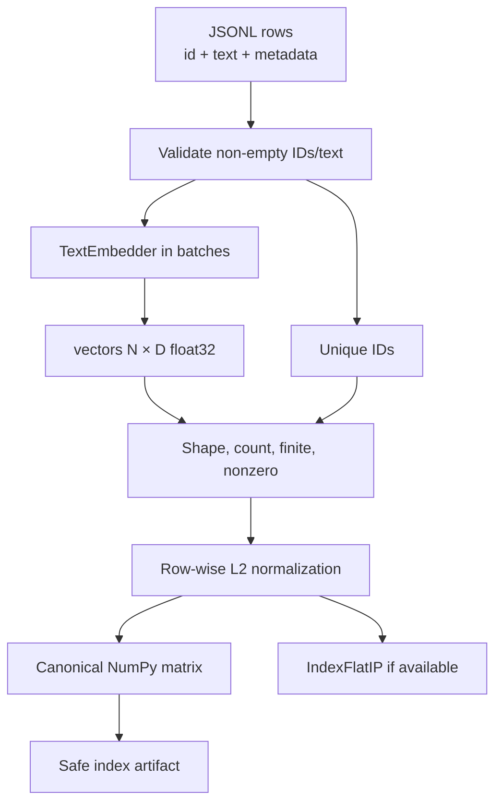
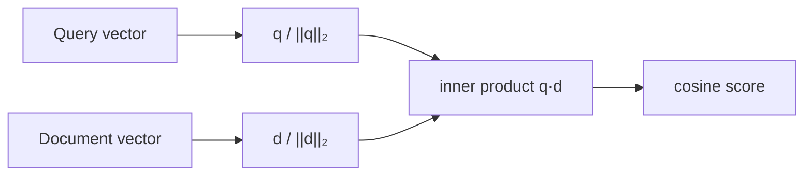
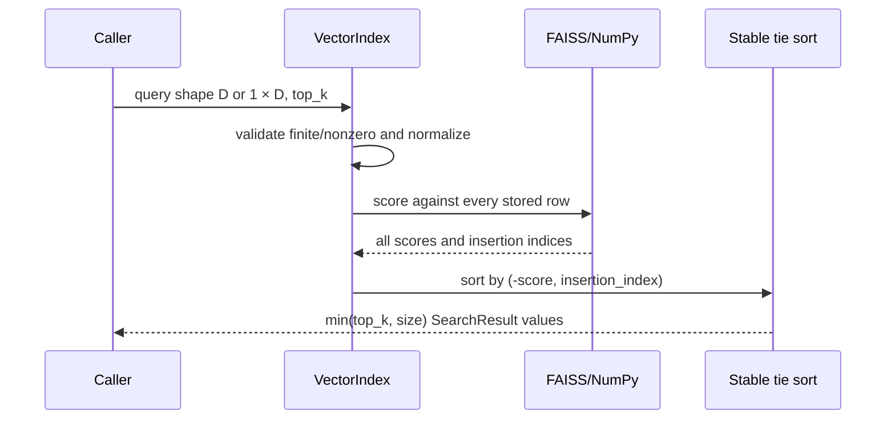
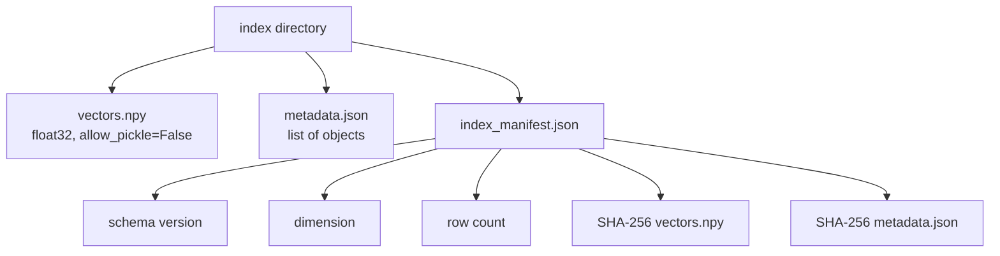
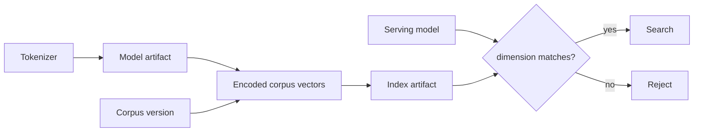

# Vector search

`VectorIndex` stores document embeddings and returns the highest cosine-similarity results for
a query. It uses exact inner-product search over normalized float32 vectors, accelerated by
FAISS `IndexFlatIP` when installed and backed by NumPy for canonical persistence and fallback.

## Build flow



Index construction rejects dimension mismatch, metadata-count mismatch, duplicate IDs,
non-string/empty IDs, non-finite values, and zero vectors. The index normalizes even if the
embedder already did, making the search contract explicit at its own boundary.

## Why normalized inner product is cosine

```text
cos(q, d) = (q · d) / (||q||₂ ||d||₂)
if ||q||₂ = ||d||₂ = 1, then cos(q, d) = q · d
```



This equivalence lets one geometry serve model training, API similarity, retrieval evaluation,
and FAISS ranking.

## Exact ranking and deterministic ties



FAISS is intentionally asked for all rows before the final stable sort. This costs more than
requesting K directly but prevents backend-specific equal-score ordering from changing the
public contract. The NumPy fallback uses the same score-descending/insertion-order rule.

## Search complexity

For \(N\) documents and width \(D\):

| Resource | Exact flat index |
|---|---|
| Vector storage | approximately `N × D × 4` bytes plus metadata |
| Query arithmetic | approximately `N × D` multiply-add work |
| Build training | none; rows are appended |
| Recall | 1.0 relative to the same stored vectors/scoring |
| Scaling limit | full scan and full in-memory matrix |

```mermaid
flowchart LR
    CorpusSmall[Corpus fits memory and latency SLO] --> Exact[Keep exact index]
    CorpusLarge[Memory/latency exceeds SLO] --> Baseline[Measure exact results]
    Baseline --> ANN[Evaluate IVF/HNSW/PQ]
    ANN --> Compare[Recall@K, p95 latency, memory, build cost]
    Compare --> Decision{Meets quality and operations targets?}
```

Do not adopt ANN solely from corpus size folklore. Use exact search as the ground-truth ranking
for recall measurements.

## On-disk format



Load verifies manifest schema, contains resolved file paths under the index root, recomputes
hashes, loads NumPy with pickle disabled, validates metadata type, reconstructs through the
same `add` validations, and compares the final size to the manifest.

Checksums detect corruption but do not prove who published the index. Restrict artifact
storage and add signed provenance in a production promotion system.

## Model/index compatibility



The code checks dimension. Operational compatibility is stronger: tokenizer bytes, model
weights/config, normalization behavior, corpus snapshot, and index must share a release
identity. Two unrelated models can have the same dimension and still produce meaningless
rankings.

## Commands

```bash
make build-index-tiny

embedding-project index \
  --model-path artifacts/model-tiny \
  --documents data/sample_documents.jsonl \
  --output-dir artifacts/index-tiny \
  --batch-size 32

embedding-project search \
  --model-path artifacts/model-tiny \
  --index-path artifacts/index-tiny \
  --query "ocean color" \
  --top-k 3
```

The build command preserves every original document field as returned metadata. Treat metadata
as untrusted content at downstream rendering boundaries; the JSON API does not interpret it.

## Failure and operations matrix

| Symptom | Boundary that rejects it | Required action |
|---|---|---|
| Empty index search | `VectorIndex.search` | Build/load a non-empty corpus |
| Wrong query dimension | Search validation | Load compatible model/index pair |
| Zero or non-finite query | Search validation | Investigate model/numeric pipeline |
| Duplicate document ID | Add validation | Canonicalize IDs before indexing |
| Tampered bytes | Load checksum | Restore a known artifact; investigate storage |
| Slow exact search | Operational measurement | Batch, shard, replicate, or evaluate ANN |

For atomic deployment, build in a new immutable directory, validate it, warm a replica with the
matching model, run smoke queries, then switch traffic. Never rewrite the active directory.
